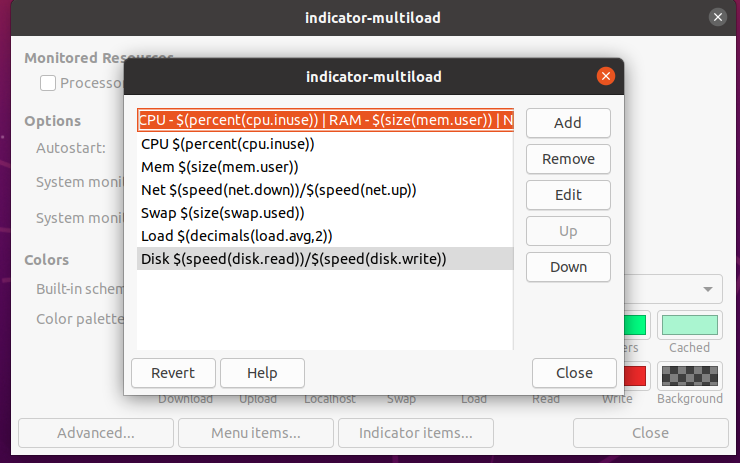

> Collection of stuff that I wish to store for future uses and also content which is so small that donot deserve a separate blogpost

## Ubuntu Network Configuration 

I run ubuntu machines in VMWare and many times the VM fails to resume for god knows what reasons.Worst if i ever manage to get it started the networking configuration is erased. Hence saving below configurations for future.

### General Way
```bash
cat /etc/network/interfaces
# This file describes the network interfaces available on your system
# and how to activate them. For more information, see interfaces(5).
# The loopback network interface
auto lo
iface lo inet loopback
# The primary network interface
auto eth0
iface eth0 inet static
        address XXX.XXX.XXX.XXX
        netmask 255.255.255.0
        gateway XXX.XXX.XXX.XXX
        dns-nameserver 8.8.8.8
        dns-nameserver 1.1.1.1
sudo service network-manager restart
```
### Using Netplan

Prerrably if your using Ubuntu 20

```shell
cat /etc/netplan/01-network-manager-all.yaml
network:
    version: 2
    renderer: networkd
    ethernets:
       ens33:
         dhcp4: yes
         nameservers:
          addresses: [8.8.8.8,1.1.1.1]
sudo netplan try
sudo netplan apply
sudo service network-manager restart
```
## System Load Monitor

Configuration settings for using [System Load Monitor](https://launchpad.net/indicator-multiload) in Ubuntu.
Looks something like below


### Updating Indicator Items

CPU - $(percent(cpu.inuse)) | RAM - $(size(mem.user)) | Net  ↓ $(speed(net.down)) ↑ $(speed(net.up)) 



## VSCode Extensions List

- auto-close-tag v0.5.7
- better-toml v0.3.2
- code-settings-sync v3.4.3
- csharp v1.22.0
- FreeMarker v0.0.9
- HCL v0.0.5
- jinja v0.0.8
- powershell v2020.6.0
- remote-ssh v0.51.0
- remote-ssh-edit v0.51.0
- remote-wsl v0.44.2
- toml v0.4.0
- VS-code-vagrantfile v0.0.7
- vscode-icons v10.1.1
- vscode-paste-image v1.0.4
- vscode-ruby v0.27.0

## Installing Minikube on Windows

*Pre-Requisites*

- Install Virtualbox
- Install Chocolatey
- Install WSL
- Install Windows Terminal

*Add in .zshrc/.bashrc*

> Replace rohit with your username

 ```bash
export DOCKER_TLS_VERIFY=1
export DOCKER_HOST=tcp://$(minikube ip):2376
export DOCKER_CERT_PATH=/c/Users/rohit/.minikube
export MINIKUBE_ACTIVE_DOCKERD=minikube
alias choco='choco.exe'
alias kubectl='kubectl.exe'
alias minikube='minikube.exe'
 ```

*Installation Commands*

```bash
 choco install kubernetes-cli
 choco install minikube
 minikube config set vm-driver virtualbox
 minikube start
 minikube dashboard
 minikube docker-env
 sudo apt-get install docker-ce
 sudo curl -L "https://github.com/docker/compose/releases/download/1.26.0/docker-compose-$(uname -s)-$(uname -m)"  -o /usr/local/bin/docker-compose
 sudo mv /usr/local/bin/docker-compose /usr/bin/docker-compose
 sudo chmod +x /usr/bin/docker-compose
 docker info
 docker-compose version
 ```

 *Refresh Env*

 ```bash
source ~/.bashrc
source ~/.zshrc
```

 *Start Script*

 ```bat
@ECHO OFF
minikube start --driver=virtualbox
 ```

 *Stop Script*

```bat
@ECHO OFF
minikube stop
```

 *Final Result*


