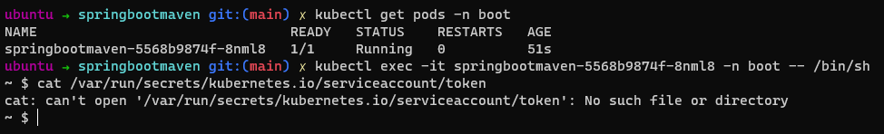

Kubernetes, is one of the [most popular and most used](https://devopscube.com/docker-container-clustering-tools/) container orchestration tool. [Kubernetes Workloads](https://kubernetes.io/docs/concepts/workloads/) are the actual applications that are executed like a simple nginx server or maybe a cron job. [Kubernetes Deployments](https://kubernetes.io/docs/concepts/workloads/controllers/deployment/) is the [most commonly used](https://rancher.com/learning-paths/introduction-to-kubernetes-workloads/#:~:text=Deployments%20are%20one%20of%20the,updates%2C%20rollbacks%2C%20and%20scaling.) workload as it can be easily updated,scaled and managed.

The recently released [Kubernetes Hardening Guide](https://media.defense.gov/2021/Aug/03/2002820425/-1/-1/1/CTR_KUBERNETES%20HARDENING%20GUIDANCE.PDF) is an excellent resource that provides a proper guidance on how to effectively secure Kubernetes. The information presented in the guide clearly shows that securing and hardening kubernetes is not just the job of the Kubernetes administrator but also of the developers who are deploying their workload on the clusters.

In this blog I'll discuss about how developers deploying Kubernetes workloads like Deployments can bootstrap security by applying some of the guidelines provided by the 'Kubrnetes Hardening guide'.

This will be a practical hands-on guide where I shall take a simple Dockerfile and then incrementally add the security best practices to **create a template Deployment manifest file** which can then be reused by developers in a hurry.

# Pre-Requisites

- Docker is required as we'll be building from ground up.
- A single-node Kubernetes cluster like minikube should be sufficient to follow along with this guide alongwith the `kubectl` utility. You can use the [official minikube](https://minikube.sigs.k8s.io/docs/start/) documentation to set it up in your environment.

I am using a standalone cluster created by [Docker Desktop](https://hub.docker.com/editions/community/docker-ce-desktop-windows) tied to WSL2 as the backend.

This guide will assume that you have a running cluster which is accessible through the kubectl utility as shown below.

 

# Securing Deployments

Securing the kubernetes workloads can effectively be compartimentalised into 'Buildtime' and 'Runtime' security. In order to run with the examples we'll make use of this simple Spring Boot HelloWorld application and deploy it in Kubernetes with buildtime and runtime security applied.

https://github.com/salecharohit/bootstrapsecurityinkubernetesdeployment

So before starting off let's clone this repository,build the docker container and run the application locally

```bash
git clone git@github.com:salecharohit/bootstrapsecurityinkubernetesdeployment.git
cd springbootmaven
docker build . -f Dockerfile.basic -t springbootmaven
docker run --name springboot -d -p 8080:8080 springbootmaven
curl http://localhost:8080

Expected Response:

Hello World From Spring Boot Build Using Maven on Alpine OS!
```

## Build Time Security

Buildtime security focusses more on how the underlying containers can be build with a reduced footprint and are programmed to be executed with least possible privileges.

We'll discuss both these approaches with a problem solution approach

### Attack Surface Reduction

When building applications in a container the primary objective is to have the app run consistently and indepdently regardless of the environment be it a data center,cloud or even onpremise.
However, when building these apps there is one unwritten rule that it should be a standalone application without much dependencies.

Let's take example of our SpringBoot application. The only dependency for our application to run is that it needs a JVM or Java runtime. Anything else baked into the container is practically useless.

As an example, in our SpringBoot container , which is build on Alpine OS , we don't have any specific need to have the requirement for the `apk` package manager to be installed.

```bash
docker exec -it springboot /bin/sh
apk add curl
```

 

So let's try to [remove the `apk`](https://stackoverflow.com/a/54428406/1679541) binary and rebuild or docker image.

We'll make use of the [Dockerfile.asr](https://github.com/salecharohit/bootstrapsecurityinkubernetesdeployment/blob/main/Dockerfile.asr) at this time to rebuild our docker container which is shared below

```Dockerfile
FROM maven:3.8.1-openjdk-17-slim AS MAVEN_BUILD
WORKDIR /build/
COPY pom.xml /build/
COPY src /build/src/
RUN mvn package

FROM openjdk:17-alpine

RUN rm -f /sbin/apk && \
    rm -rf /etc/apk && \
    rm -rf /lib/apk && \
    rm -rf /usr/share/apk && \
    rm -rf rm -rf /var/lib/apk

COPY --from=MAVEN_BUILD /build/target/springbootmaven.jar /springbootmaven.jar
EXPOSE 8080
CMD java -jar /springbootmaven.jar
```

Lets rebuild and re-rerun

```bash
# First let's stop the previously running container
docker stop springboot

# Next let's re-build and re-run
docker build . -f Dockerfile.asr -t springbootmaven
docker run --name springboot -p 8080:8080 springbootmaven
docker run --name springboot -d -p 8080:8080 springbootmaven
curl http://localhost:8080
```

Now let's try to run the `apk add curl` command again 

```bash
docker exec -it springboot /bin/sh
apk add curl
```

 

So we successfully got rid of the apk dependency and yet have our application running successfully !

Below are some good scripts that've been written specifically for hardenning Alpine OS. Pick and choose depending on your programming language and harden your base alpine image accordingly.

- https://gist.github.com/kost/017e95aa24f454f77a37
- https://github.com/ironpeakservices/iron-alpine/blob/master/Dockerfile

On the Flip-side you can also have a look at the distroless container created by google which is also very highly recommended.
- https://github.com/GoogleContainerTools/distroless/tree/main/examples


### Switching User Context

One might argue that if an attacker gains an RCE inside the container she might not be able to install packages like curl,wget etc ... to establish her persistence.

However, we are still running as "root" user and technically it is still possible to [install apk back](https://unix.stackexchange.com/a/339590/335263)

Lets re-run our docker container and check the privileges with which it is currently running.

```bash
docker exec -it springboot /bin/sh
whoami
ping rohitsalecha.com
```


Hence, it is important that we run our container not as root but as a user with limited privileges.

[Dockerfile.lpr](https://github.com/salecharohit/bootstrapsecurityinkubernetesdeployment/blob/main/Dockerfile.lpr) shows addition of a few more commands that add a user and group called "boot" and assign it a working directory (Which is its home directory)
I've also assigned numerical values to the user and group which we'll discuss in detail in the [Pod Security Context Section]()

```Dockerfile
FROM maven:3.8.1-openjdk-17-slim AS MAVEN_BUILD
WORKDIR /build/
COPY pom.xml /build/
COPY src /build/src/
RUN mvn package

FROM openjdk:17-alpine

# Removing apk package manager
RUN rm -f /sbin/apk && \
    rm -rf /etc/apk && \
    rm -rf /lib/apk && \
    rm -rf /usr/share/apk && \
    rm -rf rm -rf /var/lib/apk

# Adding a user and group called "boot"
RUN addgroup boot -g 1337 && \ 
    adduser -D -h /home/boot -u 1337 -s /bin/ash boot -G boot

# Changing the context that shall run the below commands with User "boot" instead of root
USER boot
WORKDIR /home/boot

# By default even in a non-root context, Docker copies the file as root. Hence its best practice to chown
# the files being copied as the user. https://stackoverflow.com/a/44766666/1679541
COPY --chown=boot:boot --from=MAVEN_BUILD /build/target/springbootmaven.jar /home/boot/springbootmaven.jar
EXPOSE 8080
CMD java -jar /home/boot/springbootmaven.jar
```
Lets rebuild and re-rerun

```bash
# First let's stop the previously running container
docker stop springboot

# Next let's re-build and re-run
docker build . -f Dockerfile.lpr -t springbootmaven
docker run --name springboot -d -p 8080:8080 springbootmaven
curl http://localhost:8080
```

Now let's try to run the `whoami` command and check whats the privileges with which the container is now running

```bash
docker exec -it springboot /bin/sh
whoami
ping rohitsalecha.com
```


## Runtime Security

Now that we've got a good level of confidence in the build-time security wherein we've learnt to remove the packages and also update the user context to run the container with limited privileges.
These security features are applied when we are building the docker container however we also need to focus on the security posture of the container when it is running in the Kubernetes environment which we'll explore below.

Before we start of with securing our Kubrnetes deployment let's run our application on our Kubernetes cluster by first pushing our docker container to hub.docker.com. You can use [this guide](https://docs.docker.com/docker-hub/repos/) to get started for the same

```
docker build . -f Dockerfile.lpr -t springbootmaven
docker tag springbootmaven salecharohit/springbootmaven
docker push salecharohit/springbootmaven
docker run -d -p 8080:8080 --name springboot salecharohit/springbootmaven
curl http://localhost:8080
```

Now that our docker image is ready let's apply our [kubernetes-basic.yaml](https://github.com/salecharohit/bootstrapsecurityinkubernetesdeployment/blob/main/kubernetes-basic.yaml) file that will deploy this application and also a service that will help us connect to it.

```yaml
# Create Namespace
apiVersion: v1
kind: Namespace
metadata:
  name: boot
---
# Create SpringBoot Deployment
apiVersion: apps/v1
kind: Deployment
metadata:
  labels:
    app: springbootmaven
  name: springbootmaven
  namespace: boot
spec:
  replicas: 1
  selector:
    matchLabels:
      app: springbootmaven
  template:
    metadata:
      labels:
        app: springbootmaven
    spec:
      containers:
      - image: salecharohit/springbootmaven
        name: springbootmaven
        ports:
        - containerPort: 8080
---
# Create Service for SpringBoot Deployment
apiVersion: v1
kind: Service
metadata:
  labels:
    app: springbootmaven
  name: springbootmaven
  namespace: boot
spec:
  ports:
  - name: "http"
    port: 8080
    targetPort: 8080
  selector:
    app: springbootmaven
```

Next let's deploy our Kubernetes manifests using the below commands

```bash
kubectl apply -f kubernetes-basic.yaml
kubectl get deploy -n boot
# Run a temporary container that will only curl our bootservice
kubectl run -it testpod --image=radial/busyboxplus:curl --restart=Never --rm -- curl http://springbootmaven.boot.svc.cluster.local:8080

Expected Output:
Hello World From Spring Boot Build Using Maven on Alpine OS!pod "testpod" deleted
```


### Service Account Tokens

If a Pod needs to communicate with the Kubernetes API-Server it needs [Service Account Tokens](https://kubernetes.io/docs/tasks/configure-pod-container/configure-service-account/) for authentication.

[By default](https://kubernetes.io/docs/tasks/configure-pod-container/configure-service-account/#use-the-default-service-account-to-access-the-api-server) every pod gets assigned a service account token which is mounted on `/var/run/secrets/kubernetes.io/serviceaccount/token`.
Lets view this in practice by deploying our SpringBoot app

```bash
kubectl get pods -n boot
kubectl exec -it springbootmaven-7d7c5c8597-mndv9 -n boot -- /bin/sh
cat /var/run/secrets/kubernetes.io/serviceaccount/token
curl -k -H "Authorization:Bearer {token}" https://kubernetes.docker.internal:6443/version
```


An RCE vulnerability on your application can leak this access token to the attacker which [she can abuse to read-write resources in the same namespace or even have a global read permissions.](https://hackersvanguard.com/abuse-kubernetes-with-the-automountserviceaccounttoken/)

The resolution for this issue is two-fold depending upon the situation.

1. Pods donot need any access to the API-Server
2. Pods need access to the API-Server

##### Pods that donot need access to the API-Server

This situation is farily simple to solve by simply adding two lines to the kubernetes manifest file as shown below
```yaml
      serviceAccountName: ""
      automountServiceAccountToken: false
```

The complete deployment file [kubernetes-nosa.yaml](https://github.com/salecharohit/bootstrapsecurityinkubernetesdeployment/blob/main/kubernetes-nosa.yaml) is as follows

```yaml
apiVersion: apps/v1
kind: Deployment
metadata:
  labels:
    app: springbootmaven
  name: springbootmaven
  namespace: boot
spec:
  replicas: 1
  selector:
    matchLabels:
      app: springbootmaven
  template:
    metadata:
      labels:
        app: springbootmaven
    spec:
      containers:
      - image: salecharohit/springbootmaven
        name: springbootmaven
        ports:
        - containerPort: 8080
      serviceAccountName: ""
      automountServiceAccountToken: false  
```

Let's check if the service account token is now mounted or not

```bash
# Ensure our previous deploy is deleted. 
kubectl delete ns boot

# Apply with no service account token
kubectl apply -f kubernetes-nosa.yaml
kubectl get pods -n boot
kubectl exec -it springbootmaven-5568b9874f-8nml8 -n boot -- /bin/sh
cat /var/run/secrets/kubernetes.io/serviceaccount/token
```

As can be seen from the image the default service account token is no longer mounted.



##### Pods that need access to the API-Server

In this situation we need to create a ServiceAccount,Role and RoleBinding that maps the ServiceAccount to the Role. 
The below Kubernetes manifest 
- Creates a ServiceAccount called bootserviceaccount to a specific namepspace i.e. boot
- Creates a Role called bootservicerole with only privileges to view running pods
- Creates a RoleBinding called bootservicerolebinding
- Mount the ServiceAccount thus created using the following lines in the Deployment

```yaml
    ---
          spec:
      containers:
      - image: salecharohit/springbootmaven
        name: springbootmaven
        ports:
        - containerPort: 8080
      serviceAccountName: bootserviceaccount
    ---
```

This shall allow to only read pods in the "boot" namespace.

The complete deployment file [kubernetes-withsa.yaml](https://github.com/salecharohit/bootstrapsecurityinkubernetesdeployment/blob/main/kubernetes-withsa.yaml) is as follows

```yaml
# Create Namespace
apiVersion: v1
kind: Namespace
metadata:
  name: boot
---
apiVersion: v1
kind: ServiceAccount
metadata:
  name: bootserviceaccount
  namespace: boot
---
kind: Role
apiVersion: rbac.authorization.k8s.io/v1
metadata:
  name: bootservicerole
  namespace: boot
rules:
  - apiGroups: [""]
    resources: ["pods"]
    verbs: ["get", "list", "watch"]
---
kind: RoleBinding
apiVersion: rbac.authorization.k8s.io/v1
metadata:
  name: bootservicerolebinding
  namespace: boot
subjects:
  - kind: ServiceAccount
    name: bootserviceaccount
    namespace: boot
roleRef:
  kind: Role
  name: bootservicerole
  apiGroup: rbac.authorization.k8s.io
---
# Create SpringBoot Deployment
apiVersion: apps/v1
kind: Deployment
metadata:
  labels:
    app: springbootmaven
  name: springbootmaven
  namespace: boot
spec:
  replicas: 1
  selector:
    matchLabels:
      app: springbootmaven
  template:
    metadata:
      labels:
        app: springbootmaven
    spec:
      containers:
      - image: salecharohit/springbootmaven
        name: springbootmaven
        ports:
        - containerPort: 8080
      serviceAccountName: bootserviceaccount
---
# Create Service for SpringBoot Deployment
apiVersion: v1
kind: Service
metadata:
  labels:
    app: springbootmaven
  name: springbootmaven
  namespace: boot
spec:
  ports:
  - name: "http"
    port: 8080
    targetPort: 8080
  selector:
    app: springbootmaven
```

Let's apply and check if our application is running fine

```bash
# Ensure our previous deploy is deleted. 
kubectl delete ns boot

kubectl apply -f kubernetes-withsa.yaml
kubectl run -it testpod --image=radial/busyboxplus:curl --restart=Never --rm -- curl http://springbootmaven.boot.svc.cluster.local:8080
```
### Pod Security Contexts

Though we've configured our base docker image to run with non-root privileges however, there are still few more configurations that need to be added as security best practices. These are
1. Restricting the capabilities of the container and the pod
2. Disabling Privilege Escalation
3. Configuring the container to run with a specific uid/gid created earlier in our [Dockerfile.lpr](https://github.com/salecharohit/bootstrapsecurityinkubernetesdeployment/blob/main/Dockerfile.lpr)

In the kubernetes manifest files there are two types of "SecurityContexts" defined.

- Running at Pod-Level which will be applied to all containers running in this pod

```yaml
      ---
      securityContext:
        fsGroup: 1337
        runAsNonRoot: true
        runAsUser: 1337
      containers:
      ---
```

- Running at Container-level 

```yaml
      ---
        securityContext:
          allowPrivilegeEscalation: false
          privileged: false
          runAsUser: 1337
          capabilities:
            drop: ["SETUID", "SETGID"]
      serviceAccountName: ""
      automountServiceAccountToken: false
      ---
```

The complete deployment file [kubernetes-ps.yaml](https://github.com/salecharohit/bootstrapsecurityinkubernetesdeployment/blob/main/kubernetes-ps.yaml) embedded with the PodSecurity contexts is below

```yaml
# Create Namespace
apiVersion: v1
kind: Namespace
metadata:
  name: boot
---
# Create SpringBoot Deployment
apiVersion: apps/v1
kind: Deployment
metadata:
  labels:
    app: springbootmaven
  name: springbootmaven
  namespace: boot
spec:
  replicas: 1
  selector:
    matchLabels:
      app: springbootmaven
  template:
    metadata:
      labels:
        app: springbootmaven
    spec:
      securityContext:
        fsGroup: 1337
        runAsNonRoot: true
        runAsUser: 1337
      containers:
      - image: salecharohit/springbootmaven
        name: springbootmaven
        ports:
        - containerPort: 8080
        securityContext:
          allowPrivilegeEscalation: false
          privileged: false
          runAsUser: 1337
          capabilities:
            drop: ["SETUID", "SETGID"]
      serviceAccountName: ""
      automountServiceAccountToken: false
---
# Create Service for SpringBoot Deployment
apiVersion: v1
kind: Service
metadata:
  labels:
    app: springbootmaven
  name: springbootmaven
  namespace: boot
spec:
  ports:
  - name: "http"
    port: 8080
    targetPort: 8080
  selector:
    app: springbootmaven
```

Let's apply and test if our application is running

```bash
# Ensure our previous apply is deleted
kubectl delete ns boot
kubectl apply -f kubernetes-ps.yaml
kubectl run -it testpod --image=radial/busyboxplus:curl --restart=Never --rm -- curl http://springbootmaven.boot.svc.cluster.local:8080
kubectl get pods -n boot
kubectl exec -it springbootmaven-56c64ff85-mqz2z -n boot -- /bin/sh
whoami
id
ping google.com
```


You can drop more capabilities as per your requirements. The complete list of capabilities can be found here
- https://github.com/torvalds/linux/blob/master/include/uapi/linux/capability.h

Features like AppArmor,SecComp etc ... require additional configurations of the control plane components and hence I've limited my discussion to out-of-the-box features that can be easily activated and ensure good level of security assurance.

### Immutable File-Systems

Applications running in a containerised environment seldom write data as it practically goes against the logic of having an `immutable` system. However, at times it maybe needed for caching or temporary swapping/processing of files. Hence, to provide this functionality to the developer we can mount an [`emptyDir`](https://kubernetes.io/docs/concepts/storage/volumes/#emptydir) as an ephemeral volume which is lost once the container is killed.

With this in place we can also add another security context attribute called "readOnlyRootFilesystem" and set it as true since the application running inside the container no longer needs to write anywhere on the file-system other than the 'tmp' directory.

The above requirements can be configured as shown below.

```yaml
  ---
      containers:
      - image: salecharohit/springbootmaven
        name: springbootmaven
        ports:
        - containerPort: 8080
        securityContext:
          readOnlyRootFilesystem: true
        volumeMounts:
        - mountPath: /tmp
          name: tmp
      volumes:
      - emptyDir: {}
        name: tmp
  ---
```

The complete deployment file [kubernetes-rofs.yaml](https://github.com/salecharohit/bootstrapsecurityinkubernetesdeployment/blob/main/kubernetes-rofs.yaml) is as follows

```yaml
# Create Namespace
apiVersion: v1
kind: Namespace
metadata:
  name: boot
---
# Create SpringBoot Deployment
apiVersion: apps/v1
kind: Deployment
metadata:
  labels:
    app: springbootmaven
  name: springbootmaven
  namespace: boot
spec:
  replicas: 1
  selector:
    matchLabels:
      app: springbootmaven
  template:
    metadata:
      labels:
        app: springbootmaven
    spec:
      securityContext:
        fsGroup: 1337
        runAsNonRoot: true
        runAsUser: 1337
      containers:
      - image: salecharohit/springbootmaven
        name: springbootmaven
        ports:
        - containerPort: 8080
        securityContext:
          allowPrivilegeEscalation: false
          readOnlyRootFilesystem: true
          privileged: false
          runAsUser: 1337
          capabilities:
            drop: ["SETUID", "SETGID"]
        volumeMounts:
        - mountPath: /tmp
          name: tmp
      serviceAccountName: ""
      automountServiceAccountToken: false
      volumes:
      - emptyDir: {}
        name: tmp

---
# Create Service for SpringBoot Deployment
apiVersion: v1
kind: Service
metadata:
  labels:
    app: springbootmaven
  name: springbootmaven
  namespace: boot
spec:
  ports:
  - name: "http"
    port: 8080
    targetPort: 8080
  selector:
    app: springbootmaven

```

Let's apply and test if our application is running

```bash
# Ensure our previous apply is deleted
kubectl delete ns boot

kubectl apply -f kubernetes-rofs.yaml
kubectl run -it testpod --image=radial/busyboxplus:curl --restart=Never --rm -- curl http://springbootmaven.boot.svc.cluster.local:8080
kubectl get pods -n boot
kubectl exec -it springbootmaven-56c64ff85-mqz2z -n boot -- /bin/sh
pwd
touch test.txt
```


# Conclusion

We've learnt what are the different controls we can embed in our containerised application and also looked at how to enable run-time protection mechanisms that can atleast make things difficult for an external attacker to gain foothold into our containerised systems.

The [kubernetes-rofs.yaml](https://github.com/salecharohit/bootstrapsecurityinkubernetesdeployment/blob/main/kubernetes-rofs.yaml) can serve as a good template for developers to containerse their applications with default security features enabled while deploying in a Kubernetes environment.

Offcourse the Dockerfile needs to be created for the specific applications but for that purpose I've collected a few of them here 
- https://github.com/salecharohit/dockerfilesrepo

# References

- https://blog.atomist.com/security-of-docker-kubernetes/
- https://media.defense.gov/2021/Aug/03/2002820425/-1/-1/1/CTR_KUBERNETES%20HARDENING%20GUIDANCE.PDF
- https://cloudogu.com/en/blog/k8s-app-ops-part-3-security-context-1
- https://www.cyberciti.biz/faq/how-to-add-and-delete-users-on-alpine-linux/
- https://kubernetes.io/docs/tasks/configure-pod-container/security-context/
- https://kubernetes.io/docs/reference/generated/kubernetes-api/v1.22/
- https://sysdig.com/wp-content/uploads/2019/01/kubernetes-security-guide.pdf