Having a space to express your thoughts or share your knowledge is a soul satisfying endeavour for many. Hence there are multiple blogging platforms like Blogger,Wordpress etc… where we can easily create a website and start writing. I previously used Wordpress(hosted) and Blogger but eventually moved to having a platform which is more flexible to my needs and requirements.

#### Issues with hosted Wordpress solution
If you are using wordpress hosted solution you need to constantly update your plugins and your wordpress core from time to time

Another big problem is of managing TLS certificates. Renewal , payments and configuration everything has to be done manually and to be honest just for a simple blog it was an overkill.

#### Issues with Blogger

Blogger was definitely a notch better than wordpress as i did not have to worry about managing the application and it also provided a TLS certificate with integration with LetsEncrypt. However the customization options and theming options were very much limited.

I tried to customize my blog adding HTML and CSS but then it becomes difficult to manage the content.

#### Hugo,Netlify and Academic

This blog is built using Hugo,Netlify and Academic.

[Hugo](https://gohugo.io/) is a simple framework written in Go which basically converts Markdown files into static HTML and [Academic](https://themes.gohugo.io/academic/) is a templating theme for the same.
[Netlify](https://www.netlify.com/) is a hosting platform where we can deploy our simple markdown files which would then run a build and deploy our website.

The basic advantage of using this approach are

1. We get a simple static website with no overhead of maintenance or updates.
2. Plenty of [themes](https://themes.gohugo.io/) and customization options available.
3. You are simply creating content in Markdown and Hugo+Netlify do all the magic in the backend
4. You get to preview your website locally before pushing changes to production
5. Netlify provides HTTPS service be default for its subdomain as well as any customized domain, provided your NS records point to Netlify more on this later.

So if you are also looking for building a personal blog using Hugo,Academic and Netlify then follow on

#### Accounts Creation

Firstly,you’ll need to create an account with [Netlify https://app.netlify.com/signup](https://app.netlify.com/signup) to host your blog and [Github](https://github.com/),Gitlab or Bitbucket to store your content.
Netlify shall pull the source from your respective repo and build your website using Hugo
Optionally if you would like to have comments on your posts then you can also create an account on Disqus(https://disqus.com/)

#### Installation

Instructions to install Academic and Hugo on Netlify have been detailed here [https://sourcethemes.com/academic/docs/install/](https://sourcethemes.com/academic/docs/install/) 

Sign into your netlify.com and browse to this URL [https://app.netlify.com/start/deploy?repository=https://github.com/sourcethemes/academic-kickstart](https://app.netlify.com/start/deploy?repository=https://github.com/sourcethemes/academic-kickstart) 

As shown below you’ll be prompted for Github access. The permissions here are restricted to only the particular repo that Netlify will create.

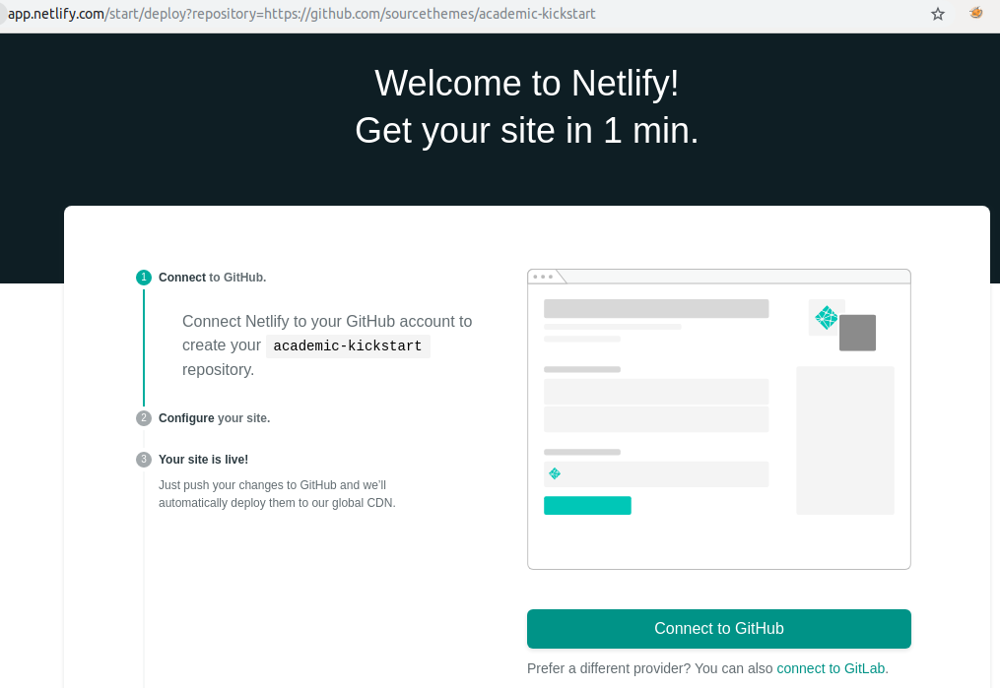 

After providing the requisite permissions Netlify will ask to create a repository as shown below.
Netlify will basically create and manage a repository on your Github account and pull the changes for building your website. You can give any name to it for ex:  testsite.com

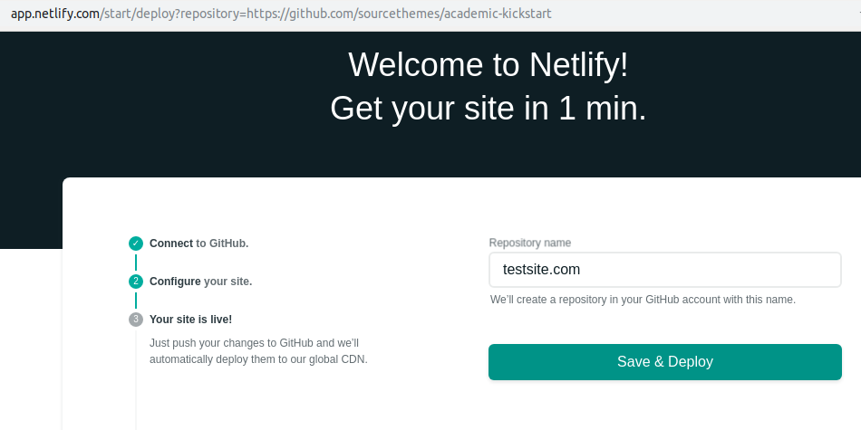

Click on “Save and Deploy “
This will create a new repository on your Github account filled with all the Hugo and Academic dependencies as shown below.

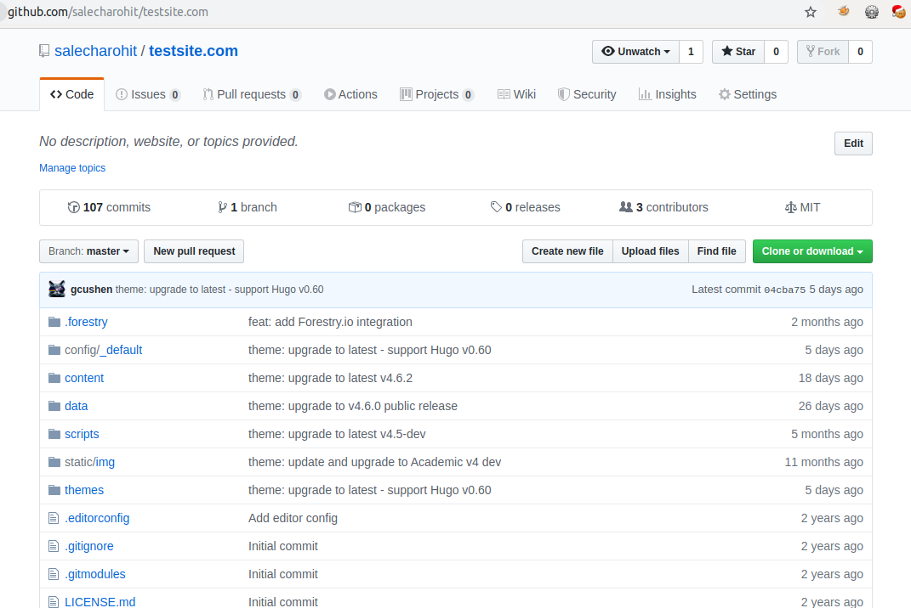

Going back to the Netlify console you’ll see that a ''' https://<random-name>.netlify.com ''' website has been generated as shown below.

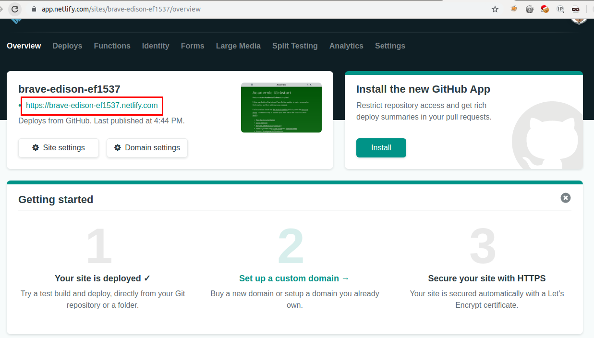

Lets browse to this new site

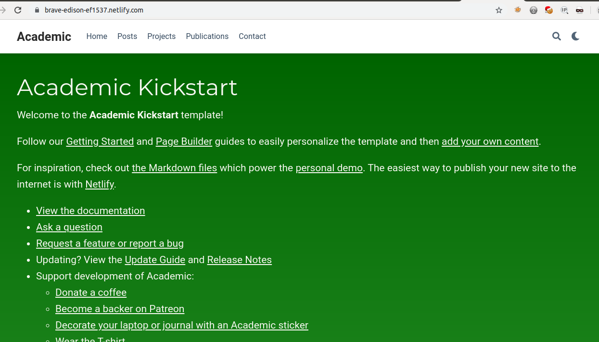

> Congratulations ! A brand new Blog with Hugo and Academic is ready !

#### Customizing Your Blog

Next,we are now interested in customizing our website. All we now need to do is move over to our Github repo and simply make the changes ! For Ex: I’ll head over to the [https://github.com/salecharohit/testsite.com/blob/master/content/home/demo.md](https://github.com/salecharohit/testsite.com/blob/master/content/home/demo.md) and delete the demo.md file.

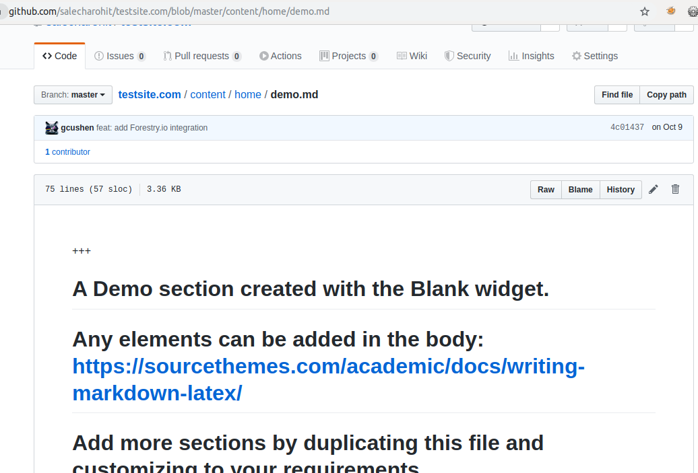

The moment you delete the file and commit the changes it can be seen that there is a new change being pushed in Netlify’s console.

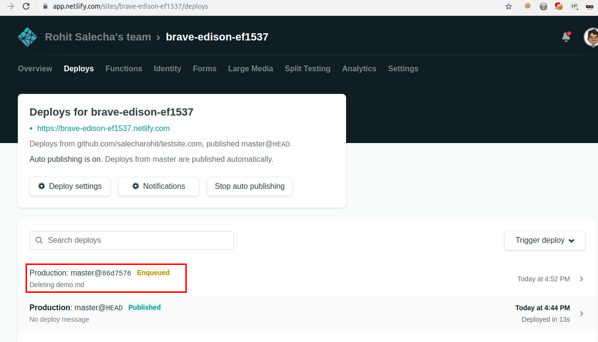

Netlify shall now build and publish our changes on the public site !

However,here we are making changes on github.com which will not be quite desirable to many.
How about making changes locally ? Follow the below steps !

1. Install [Git](https://git-scm.com/downloads) if you don't have it already
2. Download the latest Hugo (Extended) binaries from the [releases page](https://github.com/gohugoio/hugo/releases) 

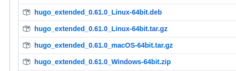

1. Clone your testsite.com repo into your local computer
```bash
git clone https://github.com/salecharohit/testsite.com
```
4. Initialize the theme
```bash
cd testsite.com
git submodule update --init --recursive
```
5. Make your changes and then
   
```bash
git add .
git commit -m “commit message”
git push
```

> You’ll need to add your Github keys/Credentials in order for git push to work.

> Awesome ! You are all set to make changes to your own Blog !

#### Understanding the Hugo+Academic Environment

Before we start with anything open a terminal and cd into your repo folder and fire the view.sh script
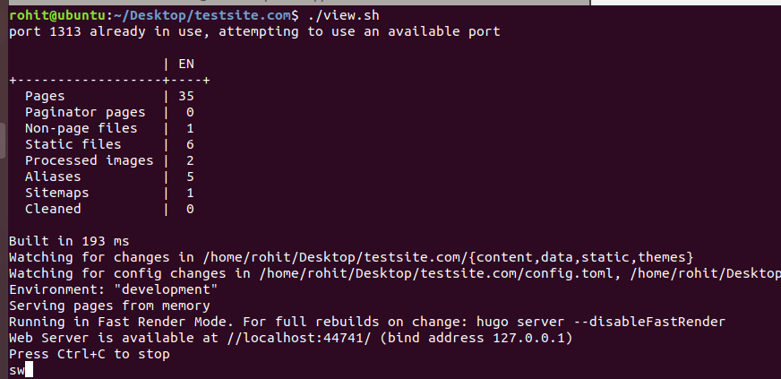

Your website can now be locally previewed on [http://localhost:1313](http://localhost:1313). Keep this running and start editing the website. Hugo will refresh and rebuild the entire website for all the saved changes.

Load your git repository into your favorite Editor. I am using [Visual Studio Code](https://code.visualstudio.com/).

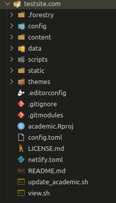

At first glance all the code and folders and config files might look extremely overwhelming but the good news is that we only need to work on two folders viz. .confg and content

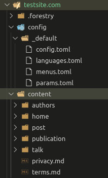

The .config folder contains all the configuration options for Hugo and Academic and most options are quite self-explanatory.

The content folder contains all the content that you wish to publish.
The first thing you might want to edit is the author name i.e. your name rather than admin.

To do that first you need to open the [https://github.com/salecharohit/testsite.com/blob/master/content/home/about.md ](https://github.com/salecharohit/testsite.com/blob/master/content/home/about.md) file and edit the highlighted element.Lets say author=test

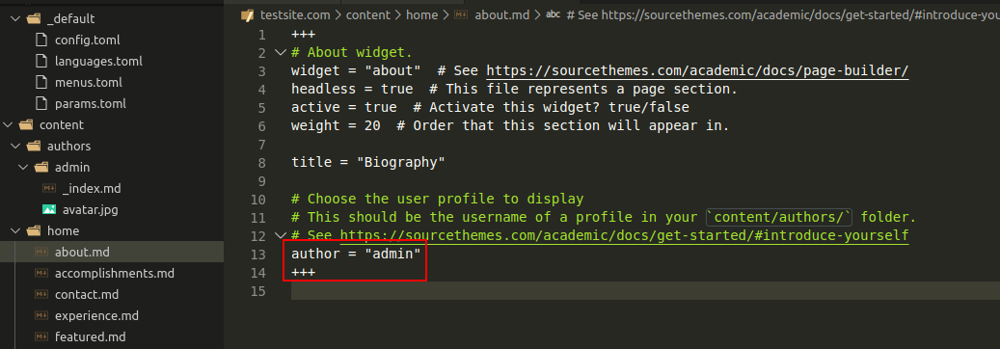

Next , under the authors folder rename the “admin” folder to whatever name you’ve chosen i.e. test
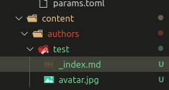

Next you may want to modify the _index.md file to reflect your own data.
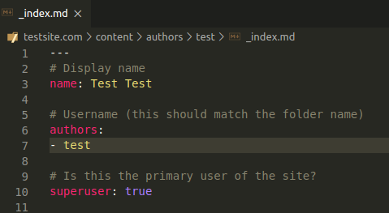

Save the changes and then preview your site locally !
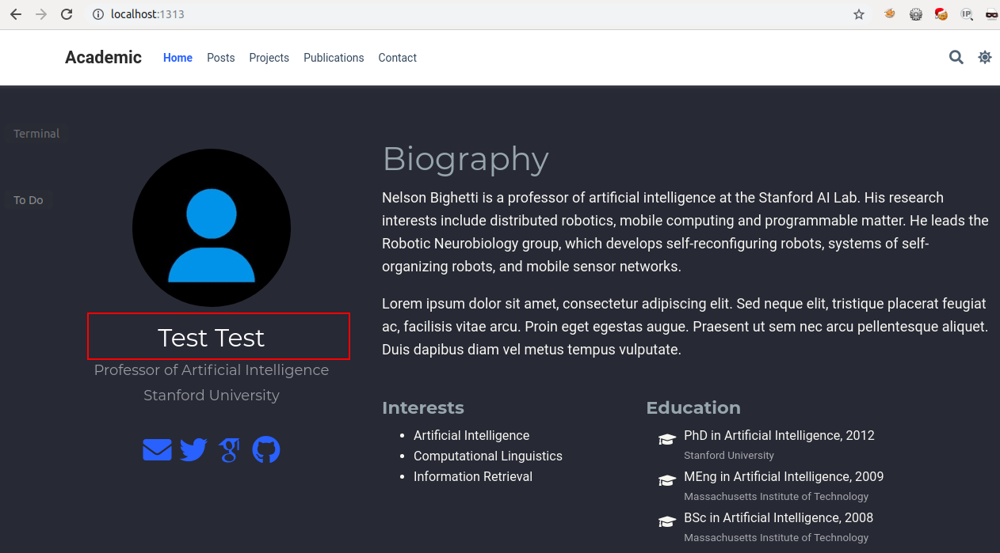

In order to create a new post just fire the command
```bash
hugo new --kind post post/<post_name>
hugo new --kind post post/test_post
```

It’ll create a new folder with the same name as the post name and an _index.md file as shown below.
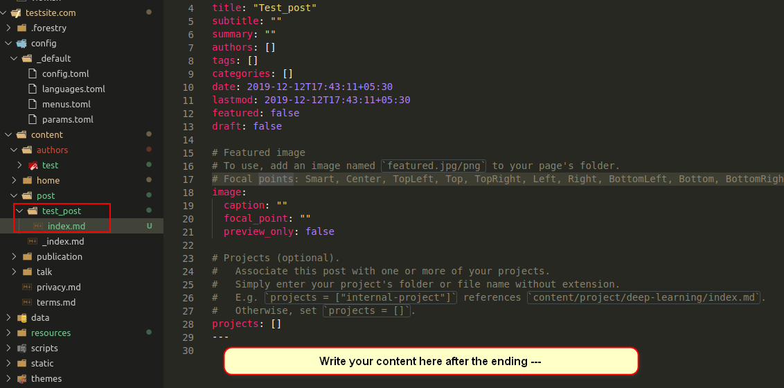

Now simply add your content in the Markdown format [https://learn.netlify.com/en/cont/markdown/](https://learn.netlify.com/en/cont/markdown/)

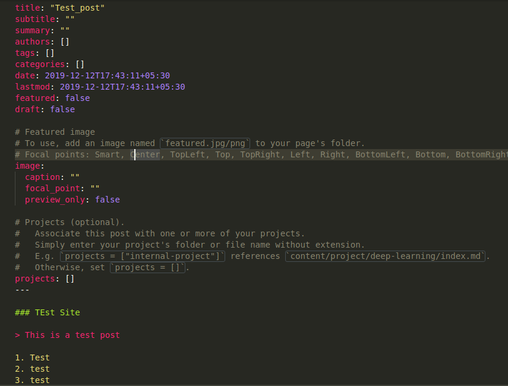

View the changes

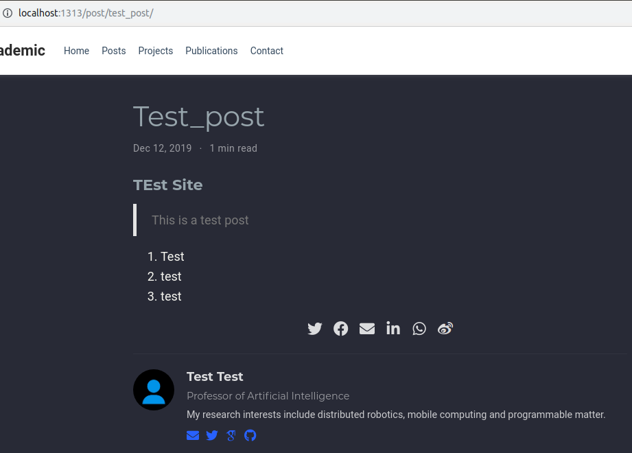

Academic has many options to take your blog to the next level using [Markdown,Latex and many inbuilt shortcodes](https://sourcethemes.com/academic/docs/writing-markdown-latex/).Your imagination is the limit !

#### Customizing Domain

Using Netlify you can customize the domain name by clicking on “Overview” → “Site Settings” → “Site Details” and “Edit Site Name” as shown below.

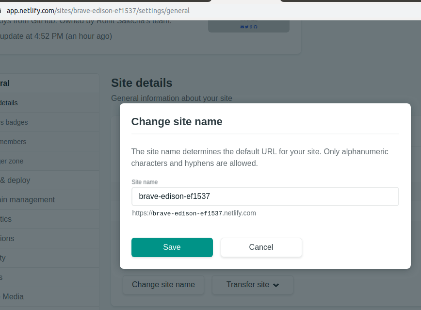

This will however always give you a sub-domain of netlify.com for example https://testsite.netlify.com

You can also add a custom domain by following the simple steps highlighted in the netlify’s console panel “Overview” → “Domain Settings”.However for that you’ll need to point your DNS Name servers to that of netlify i.e.

```bash
dns1.p07.nsone.net
dns2.p07.nsone.net
dns3.p07.nsone.net
dns4.p07.nsone.net
```

> NOTE : Before doing this please ensure you take a backup of your DNS Zone records from the earlier NS provider.

> We have completed the most basic steps to start and run our own blog using Hugo,Netlify and Academic.Hope that helps you to create your own blog which is simple to maintain and easy to configure.