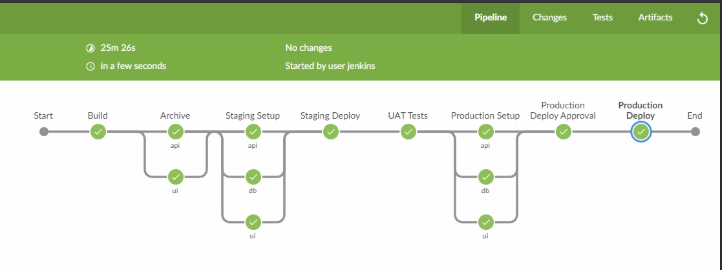

In this blog we’ll explore one of the most popular software in DevOps world i.e. Jenkins. Here we’ll understand more on the ‘Pipeline as Code’ concept which is implemented using the Jenkins pipeline feature where all the instructions are fed into the ‘Jenkinsfile’ for complete automation.

So most of our discussion in this blog will be understanding the Jenkinsfile.

## Before We Begin

I've created an entire [DevOps Lab]() which can act as a good reference to reinforce learning for the purpose of this blog.

If you’ve landed to this page directly i recommend reading my previous blogs on a related topic
- [Practical DevOps - Infrastructure as Code using Vagrant Ansible and Docker]()
- [Practical DevOps - Continous Integration using Git Vault and Talisman]()


## Introduction to Jenkins

What wordpress did to the internet , Jenkins has done to DevOps. Owing to its popularity there are many good blogs on Jenkins to get started. Here we already have a working Jenkins instance provisioned using Ansible thanks to the geerlinguy-Jenkins-role. I’ve also added a few customization to our installation which can be found in the following file https://github.com/salecharohit/devops/blob/master/infrastructure/provisioning/jenkins/jenkins.yml


If you’ve been following my blog posts we’ve already setup a Jenkins instance and can be accessible at http://jenkins.devops:8080/ using jenkins:jenkins as credentials

We’ve already created a project and executed our pipeline looking something like this



### Software Build and Delivery Process

In a general build process of a software application something similar happens as well.
1. Developers write code
2. Code is bundled to the integration team
3. A build script is run which compiles the code and adds the dependencies
4. The build script outputs a deployable artefact
5. The deployable artefact is provided to the operations/production team to be deployed into the production environment.

The above process is quite error prone as we know owing

1. Differing environments in which developers and operations team working
2. Lack of knowledge of how code is built or even deployed
3. Lack of transparency of the entire build process
4. Many more .

### Pipeline As Code


Imagine a conveyor belt running in a factory where at different positions different features are added on the final product. What if a software build process could also be automated in this manner ? All the above 5 build steps that we’ve seen can be easily automated using Jenkins by coding the instructions in the Jenkinsfile.

Here is the complete Jenkinsfile for our project.

https://github.com/salecharohit/devops/blob/master/Jenkinsfile 


Jenkinsfile has two variants depending on the syntax with which it is written. Both syntaxes however follow Groovy DSL.

1. Declarative - Recommended by Jenkins.io and currently being used
     - Follows a declarative syntax rather than a programmatic one
     - Starts with ‘pipeline’ as the keyword.
2. Scripted
     - Follows a scripted groovy language syntax providing a lot of flexibility
     - Starts with ‘node’ keyword

If you are creating a Jenkinsfile you’ll need to opt for either of the syntaxes and while searching for help on google ensure to check what folks have used. If it starts with ‘node’ its a scripted pipeline not useful for declarative style.

### SCM Checkout

If you remember we’ve configured Jenkins to poll the SCM every minute to look for a new commit. This will effectively pull a fresh new source code every time there is a new commit.


In the Declarative style of Jenkinsfile there is an implicit stage called the “Declarative: Checkout SCM” which pulls the source code from the configured branch. It also shows the commit id and the commit message as shown below.


Jenkins when running the builds stored the source code in the $JENKINS_HOME/jobs/<project-name>/workspace folder for every build as shown below.


### Building Frontend

Our application is a multi-tier application having An AngularJS front-end and Java Spring Boot back-end sourced from https://www.baeldung.com/spring-boot-angular-web

Automating a multi-tier application deployment was definitely a challenging task.

The Angular App is having all the dependencies in the [package.json](https://github.com/salecharohit/devops/blob/master/frontend/package.json) file which are installed in the Build stage in the node_packages folder using the `npm --prefex frontend install` command.

However here we are only downloading all the dependencies, we are yet not building the app.

Since we have two environments, the build parameters are different.
For Ex: 

Our Angular Docker is running on port 80 and the back-end api is running on port 8080 hence we’ve configured a rule in the nginx as follows
https://github.com/salecharohit/devops/blob/master/frontend/nginx-staging.conf


Now this is a specific configuration file only for the staging environment as we’ve hard-coded the staging url.
That’s why before building the docker image we are renaming the nginx-staging,conf to nginx.conf


We are also passing a $STAGE environment in our [Dockerfile](https://github.com/salecharohit/devops/blob/master/frontend/Dockerfile) to execute the particular step in our package.json


The reason why we are doing this is because in the angularjs world , environment variables need to be passed exclusively through the https://github.com/salecharohit/devops/tree/master/frontend/src/environments environments folder as shown below. That's pretty much obvious because the angularjs is running on client-side and not on the server :-P


So to summarise , in order to have separate environments we need to have separate builds and to automate that we need to build different docker images on the fly.

### Building Backend

For a change , building java backends seemed like a breeze as compared to building the angularjs frontend :-D
Reason being it is very easy to pass environment variables through the -e command in the docker run step.

```bash
docker run -d -p 8080:8080 --link mysqldb -e MYSQL_DB_USER=${MYSQL_DB_USER} \
-e MYSQL_DB_PASSWORD=${MYSQL_DB_PASSWORD} -e MYSQL_JDBC_URL=${MYSQL_STAGING_URL} -e MYSQL_DB_NAME=${MYSQL_DB_NAME} \
-v /home/vagrant/logs:/home/boot/logs/ --name backend ${DOCKER_REGISTRY}/devops/api:staging"
sshCommand remote: remote, command: "docker run -d -p 80:80 --link backend \
--name frontend ${DOCKER_REGISTRY}/devops/ui:staging"
```

So the backend jar file was simply generated using the `mvn clean package’ command and while running the docker we were simply supplying different set of environment variables for staging as well as production servers.

### Artefact Archival

When you are continuously building things let's say 2 builds in a day and each build outputs 200 MBs of artefacts then we are looking at probably an additional storage of 400MB/day.

If you continue to store things in Jenkins , it’ll bloat up and crash.

Also, it would not make sense to discard those builds as we may need for root cause analysis in case of a failure or an issue.

Hence, we need to “archive” those builds and for that i’ve simply created a separate server 'archiver.devops’ with ssh running.

Using the sshSteps plugin We can then sship the artefacts into the archiver renaming them with the commit id obtained from the Jenkins default environment variable called $GIT_COMMIT


If you would like to view your artefact files simply `vagrant ssh archiver.devops` and view them in the folders as shown below


You could also peruse other archival solutions like JFrog Artifactory for which i’ve already created an [ansible playbook](https://github.com/salecharohit/devops/blob/4814f3e178785b056719a70c256de46b3fa02cd3/infrastructure/provisioning/archiver/playbook.yml#L17 )

### Docker

Here in the ‘Staging Setup’ and ‘Production Setup’ stage we are first building the docker images using the respective Dockerfiles of the frontend and the backend. After building we are then pushing our docker images to our private docker registry located at ‘registry.devops:5000’.Next we in the ‘Staging deploy’ and ‘Production Deploy’ we are running our docker containers by pulling them from the registry.

This is a very crude way of doing things and hence i shall update this project by possibly running containers on Kubernetes :-D

### The POST Block

There is a final block which is declared after all stages are completed which starts with “post”

[Code](https://github.com/salecharohit/devops/blob/4814f3e178785b056719a70c256de46b3fa02cd3/Jenkinsfile#L203)


In the post block we are declaring two conditions

1. Failure - Declaring the status of the current build as “Failed” if any of the stages above fail. A jenkins stage will fail by sending out a number greater than zero. Here we are setting currentBuild.result = 'FAILURE'
So if you don't wish your stage to fail , simply add a true condition as shown below.


2. Always - This block will run always after every build whether successful or failed.Here again we are performing two actions
   - Mailer - Send an email if the build failed or is unstable
   - WorkSpace Cleanup - For every new build Jenkins will create a fresh new workspace as discussed in the [SCM Checkout](()) section. If we keep running the builds it’ll start clogging the disk space. Hence this plugin cleans up the entire workspace after the build is complete and hence it is important to store your [artefacts]()

## Security Considerations with Jenkins

Hardening Jenkins is extremely important as it becomes one of the most critical systems in an organisation running DevOps. Some of them are

1. HTTPS on Jenkins
2. Stronger password
3. HTTPS and Credentials on Docker Registry
4. Keep your Jenkins and Plugins updated.We are currently running only on 2.91 because the ansible jenkins role is not      downloading the plugins for the latest version of Jenkins. https://github.com/geerlingguy/ansible-role-jenkins/issues/269.
However, you can follow the instructions [provided here]() to update Jenkins to a particular version.
Securing Credentials in Jenkinsfile

The Jenkinsfile is another avenue where credentials and sensitive information can be leaked.

If you’ve followed our [DevOps Lab Setup Instructions]() in the first blog then you must’ve observed that we added two secret strings ‘mysqldbpw’ and ‘mysqlroot’. Below screenshots show how we are utilising the strings ,utilising the ‘withCredentials’ declaration in Jenkins.


The good part of utilising this technique is that we are not avoiding leakage of credentials in the Jenkinsfile but also in the log files the credentials are “masked”


