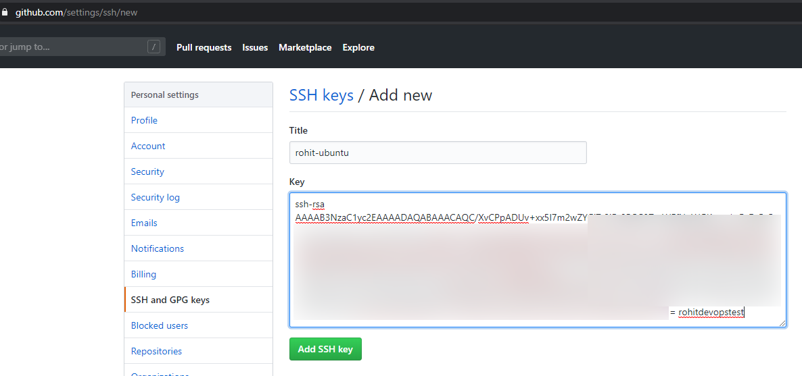
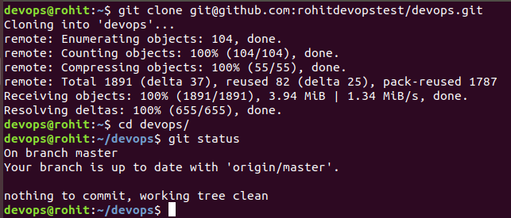
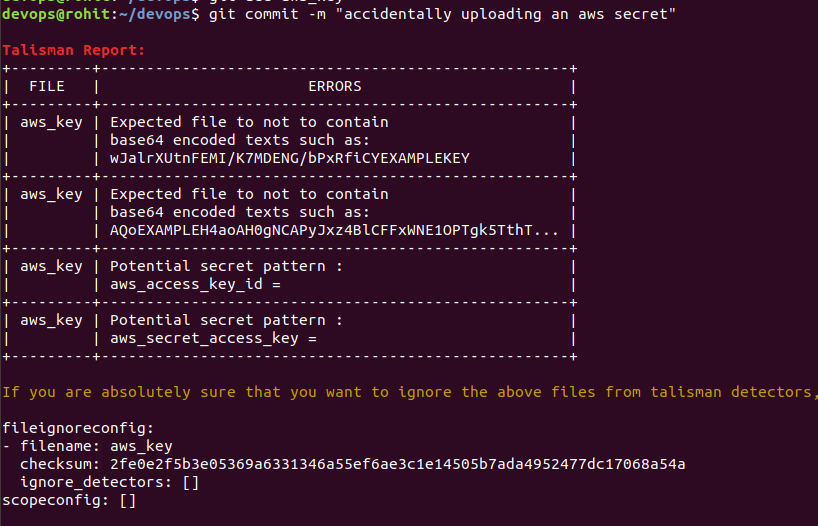

In this blog we’ll explore about Source Code Management using git, tokenization of credentials using Hashicorp Vault and how to avoid leakage of sensitive information using Talisman.

## Before We Begin

I've created an entire [DevOps Lab]() which can act as a good reference to reinforce learning for the purpose of this blog.

If you’ve landed to this page directly i recommend reading my previous blog on [Practical DevOps using Infrastructure as Code]()

## Git

Git is a powerful distributed version control system where we can manage our source code. The key element about Git is that it is “distributed” means there is a local copy on your machine and a main copy stored somewhere on your remote servers.

### Git Fork

Let’s understand git through a practical flow.We have another user ‘rohitdevopstest’ who wishes to  add a small feature to our existing repository [https://github.com/salecharohit/devops](https://github.com/salecharohit/devops)

First thing that rohitdevopstest will need to do is ‘Fork’ our repository into his own account as shown below.


Once Fork is completed it’ll show something like below


### Generating SSH-Keypair

If you are a Windows user i recommend you first [install WSL(Windows Sub-system for Linux)]() as it’ll make your life a lot easier to work with in a DevOps environment.

Below steps assume you either have a WSL shell or alternatively Git Bash shell running on your Windows machine.

```bash
 ssh-keygen -t rsa -b 4096 -C "rohitdevopstest"
```


Copy the contents of the github.pub file and visit https://github.com/settings/keys from the browser where you are currently logged-in and then click on ‘New SSH Key’


Paste the contents of the github.pub file that was recently generated.




Add a file called ‘config’ under the ~/.ssh folder (create it if it doesn’t exist) and enter the below details

```plain
Host github.com
Hostname github.com
Port 22
User git
IdentitiesOnly yes
IdentityFile ~/.ssh/github
```


Then run `ssh github.com`


### Git Clone

Now that we’ve added the key lets go ahead and clone the project.

Click on ‘Clone or download’ and copy the git URL


```bash
cd ~
git clone git@github.com:rohitdevopstest/devops.git
```



### Working with Git

Now let's make some changes and push it to the central repository by modifying the README.md file


View the changes ```git diff README.md```


Staging the changes. This step confirms that you accept the changes that’ve been made.

```bash
git add README.md
```
Now before we go ahead and commit the changes we need to fire the below commands

```bash
 git config user.email "test@devops.devops"
 git config user.name "DevOps Test"
```

Next , let's commit the changes

```bash
git commit -m “Updated README.md”
```

Git Commit saves the changes to the local instance of git. Remember Git is a distributed system. There’ll be a local copy and a remote copy. So with ‘git commit’ you’ve saved the changes in the local copy.


Let's Push our changes to the remote copy or the remote instance on github.com

```bash
git push
```


### Git Branch

Till now currently we were working only on the ‘master’ branch. What if we have a team member who would want to work on a new feature of our code. In this case it is not advisable to allow him to modify the contents of the ‘master’ branch. Hence,we create a new branch called “dev” and make a few changes there which will then be merged back to master.

```bash
git status
git branch dev
git checkout dev
```


Modifying a file in ‘dev’ branch and commiting the changes in ‘dev’ branch itself


Now since our changes have been saved lets go ahead and merge the changes with the master branch.

```bash
git checkout master
git merge dev
```


Let's push our changes to the main repo


### Pull Request

All the changes that we’ve done till now were done in the repository of the user ‘rohitdevopstest’. The below message from github also shows that the main repo ‘salecharohit:master’ is behind by 2 commits.

How can we now merge the changes with the main repo ?


In order to merge the changes with the main repo , user ‘rohitdevopstest’ needs to create a ‘Pull Request’ by clicking on the button ‘New pull request’


The below Pull Request screen gives us a good idea about the changes that we are going to commit or rather suggest to the owner of the main repository.


Upon clicking on the ‘Create pull request’ button we can view the below screen where we need to inform the owner ‘salecharohit’ the changes that we are suggesting.


Summary of our Pull Request


Upon logging into the main repository we can now view the ‘Pull Request’ suggested by ‘rohitdevopstest’


Lets go ahead and approve the PR by clicking on ‘Merge Pull request’


Confirming the merge


Our changes have now been merged


Coming back to our Local System , we now need to perform a git pull to merge the changes as well.


### Git Summary

Below is the summary of commands that we saw


```bash
ssh-keygen -t rsa -b 4096 -C "username"
git diff <filename>
git add <staging-file>
git config user.email "test@devops.devops"
git config user.name "DevOps Test"
git commit -m “commit message”
git push
git status
git branch <branch-name>
git checkout <branch-name>
git merge <branch-name>
git pull
```

### Git Security Considerations

With using git a lot of times developers execute commands like `git add . `

The ‘period’ after `git add` signifies that all files that have been changed or modified must be committed. This complacency can at times lead to issues like

1. Leakage of sensitive information like SSH keys,credentials etc...
2. Binary files clogging your git repository
3. Configuration files containing development data going into public domain

Points 2 and 3 can be easily tackled if we create a simple .gitignore file in the root of our system. This website https://www.gitignore.io/ is an external start to create .gitignore files

A sample .gitignore file for java applications on Windows using eclipse IDE is

https://www.gitignore.io/api/java,windows,eclipse 


For point 1) there are two approaches

- Employing Pre-Commit Hooks
- Tokenizing credentials

#### Pre-Commit Hooks using Talisman

Pre-Commit or Pre-Push hooks are simple scripts that execute whenever you type the commands ‘git commit’ or ‘git push’ respectively. They analyze the changes made against a set of regexes and throw an error stopping the commit.These are extremely useful as they can help stop leakage of sensitive information.

One such pre-commit/pre-push tool is [Talisman by Thoughtworks](https://github.com/thoughtworks/talisman) which is worth installing in your system.

There are multiple ways in which Talisman can be installed

- Installing Globally
   - Pre-Commit Hook
      ```bash
      curl --silent  https://raw.githubusercontent.com/thoughtworks/talisman/master/global_install_scripts/install.bash > /tmp/install_talisman.bash && /bin/bash /tmp/install_talisman.bash
      ```
  - Pre-Push Hook
    ```bash
    curl --silent  https://raw.githubusercontent.com/thoughtworks/talisman/master/global_install_scripts/install.bash > /tmp/install_talisman.bash && /bin/bash /tmp/install_talisman.bash pre-push
    ```

- Installing to a Single Project (by default installs as Pre-Push Hook)
  ```bash
  curl https://thoughtworks.github.io/talisman/install.sh > ~/install-talisman.sh
  ```
 Let’s install a Pre-Commit Hook globally to all the repo in the home folder

 

Exit and open a new instance of the Terminal. Create a new file in our repo called “aws_key” and add the following data in it.

`aws_access_key_id = 123456789012
aws_secret_access_key = wJalrXUtnFEMI/K7MDENG/bPxRfiCYEXAMPLEKEY
aws_session_token = AQoEXAMPLEH4aoAH0gNCAPyJxz4BlCFFxWNE1OPTgk5TthT+FvwqnKwRcOIfrRh3c/LTo6UDdyJwOOvEVPvLXCrrrUtdnniCEXAMPLE/IvU1dYUg2RVAJBanLiHb4IgRmpRV3zrkuWJOgQs8IZZaIv2BXIa2R4Olgk`


Now let’s try to commit our changes. What we see is an error and our commit has been stopped.



Hence,Talisman is a very good tool and a must to avoid leakage of sensitive information.

##### Security Considerations with Talisman

Talisman is not a silver bullet just like any security other tool/solution.The protection provided by Talisman is as effective as is the developers intention. It is quite possible that he/she may totally remove the check by simply deleting the binary located at the .git/hooks folder of your repository.

Hence, having Talisman or any other pre-commit/pre-push hook will not provide a 100% assurance that data will not be leaked.

#### Credentials Tokenization using Hashicorp Vault

Every web application requires storing certain credentials to access services like databases.

These credentials are then stored in clear-text format either in text/properties files or as environment variables.Any compromise of the system can expose your environment variables containing the sensitive credentials or a [Local File Inclusion (LFI)](https://en.wikipedia.org/wiki/File_inclusion_vulnerability) vulnerability can be used to read the contents of the text/properties files.

Also in a DevOps environment there is no scope of manually entering credentials anywhere.If you are doing that then you aint automating.

The best solution to both problems is

1. Store the credentials in a separate machine , hopefully securely locked-down
2. This separate machine/tool must provide a unique token for that particular credential
3. In order to now access the credential the user/program must simply utilise the token.
4. So now instead of the actual credential it's your token that will be stored.
5. The machine/tool must have limited access so even if your tokens are compromised the attacker would not be able to get the credentials.


One such solution is [Hashicorp Vault](https://www.vaultproject.io/) which is a simple golang binary which encrypts all the stored credentials.

The ansible role which installs the HashiCorp vault software can be found here

https://github.com/salecharohit/devops/tree/master/infrastructure/provisioning/roles/hashicorp-vault

In our environment the vault server is located at vault.devops:8200 and can be accessed using

`vagrant ssh vault.devops`

##### Creating Tokens
In order to tokenize a credential the follow the steps below

1. Login into the Vault CLI using the root token
2. Create a credential in the KV (key-value format) at a particular path
3. Create a policy for the token
4. Create a token for that particular policy

```bash
vault status
cat /etc/vault/rootkey | vault login -
vault kv put kv/database/devops username=root password=toor
echo 'path "kv/database/devops" { capabilities = ["read","list"] }' | vault policy write devopsdb -
vault token create -policy=devopsdb -format=json | jq -r '.auth.client_token'
```

The below asciinema roll shows the above commands in execution


##### Fetching Tokens

Once the tokens are created we then need to make use of Vault APIs from within our code to fetch the credentials “programmatically” 

The below few lines of code read the token,vault address,credential path “kv/database/devops” in the earlier case from the environment.

[Code](https://github.com/salecharohit/devops/blob/4814f3e178785b056719a70c256de46b3fa02cd3/backend/src/main/java/com/rohitsalecha/springular/devops/config/JPAConfig.java#L102)


Vault API has support for almost all programming languages
https://www.vaultproject.io/api/libraries.html 

##### Vault Keys and Root Token

For the vault binary to run we first need to initialise it with a configuration file


When vault is initialised it creates 5 sets of keys of which 3 can be used to “unseal” the vault.

All these 5 keys can be found under the /etc/vault folder as shown below


In Addition to the 5 keys it also generates a rootkey which is the primary key used to “operate” the vault. It is a very important key and must not be shared with anyone other than the administrator. Using the rootkey it is possible to access the entire vault and all the credentials.

Hence ,we make use of the vault policy feature where we assign a token for each policy thereby restricting access to different credentials.

Let’s take an example.

Perusing the token generated earlier we can access the credentials stored at location kv/database/devops

```bash
VAULT_TOKEN=s.5u6tSXFOnjFz0TydLfXf59RO
curl -X GET -H "X-Vault-Token:$VAULT_TOKEN" http://vault.devops:8200/v1/kv/database/devops
```


Let’s try to access credentials stored at location kv/mysql/db using the same token.
As expected we get a Permission Denied Error.


However using the root token all credentials can be accessed. Hence it is very important to make use of policies to store credentials in vault and generate unique tokens for each policy.

##### Security Considerations while using Hashicorp Vault

1. The vault server must be in a restrictive network zone where only production servers can have access
2. Only specific individuals should’ve access to the vault server to store credentials and create tokens. These tokens can then be shared to the developers.
3. The vault server should be accessible only over HTTPS
