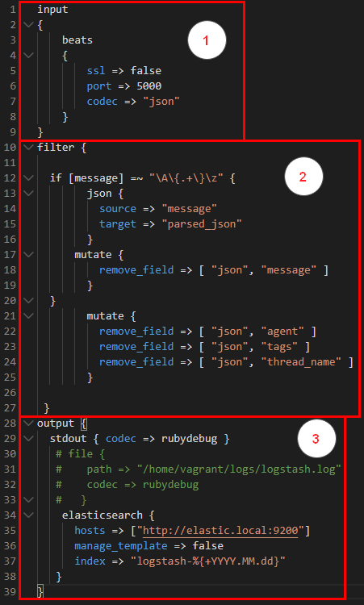

In this blog i’ll discuss continuous monitoring using tools like Elasticsearch,logstash,kibana and filebeat. Here we’ll look at the configurations for each of these tools and how application developers can help the operations team to collaborate better by throwing relevant data real-time.

## Before We Begin

I've created an entire [DevOps Lab]() which can act as a good reference to reinforce learning for the purpose of this blog.

If you’ve landed to this page directly i recommend reading my previous blogs on a related topic
- [Practical DevOps - Infrastructure as Code using Vagrant Ansible and Docker]()
- [Practical DevOps - Continous Integration using Git Vault and Talisman]()
- [Practical DevOps - Continous Delivery using Jenkins]()

## Logging and Monitoring

In a DevOps environment it becomes extremely crucial to see how your application is behaving and how it is running. What kind of data it is processing and how it is processing.A fast and efficient logging and monitoring ‘eco-system’ helps the operations team derive this information ‘real-time’.

As an Ex: if the application is running slow or has suddenly stopped working then the log files are the best way(and possibly the only way) an operations guys (ops) will be able to perform a root-cause analysis.Now in absence of a logging and monitoring ecosystem , he’ll have to manually log into the system and check the log files in a manner shown below.

```bash
cat <logfile> | tail
```


He might even have to ship the logs to another machine to perform an RCA which is a big security risk !

This process of viewing the logs is not only cumbersome but also highly inefficient and error-prone.

Here we’ll discuss how to setup an entire ecosystem for managing,indexing,searching and viewing log files real-time with the help of the FELK stack i.e. File Beats,Elasticsearch,Logstash and Kibana.

There are other monitoring softwares like [Nagios](https://www.nagios.org/) which monitor the IT infrastructure RAM capacity,CPU utilisation etc… but that is not the focus of this blog. The focus of this blog is exclusively for application logging and not infrastructure monitoring.

Below is the cut-out diagram focusing only on the FELK  stack.

In summary here

1. Filebeats is sending data from the API server to logstash
2. Logstash is processing the data and ingesting into Elasticsearch
3. Elasticsearch is indexing the data for better search
4. Kibana offers excellent UI to be able to view the data stored in elasticsearch.
  
## Application Logging

In the backend API application we’ve written a custom class to log each and every request
[Code](https://github.com/salecharohit/devops/blob/master/backend/src/main/java/com/rohitsalecha/springular/devops/config/RequestResponseLoggingFilter.java)


This filter converts the entire request in JSON format and then logs it.

For creating the log files we are utilising the ‘ch.qos.logback’ library which writes the log files in JSON format as shown below


Logback is configured in the [logback-spring.xml](https://github.com/salecharohit/devops/blob/master/backend/src/main/resources/logback-spring.xml) file.

It is extremely important that the application spools out data in JSON format as we’ll understand while discussing the filter module of logstash configuration file.


## Filebeats

Filebeats is a simple golang binary which reads the log file real-time and has capability to ship to various output sources like Elasticsearch,Logstash etc… for further processing.

I’ve created a simple Ansible role to install filebeats https://github.com/salecharohit/devops/tree/master/infrastructure/provisioning/roles/elk-filebeat on the server from where we need to read the log files.

This is how we’ve added filebeats in our staging server deployment https://github.com/salecharohit/devops/blob/master/infrastructure/provisioning/staging/playbook.yml 

We just need to provide the path of the log files using the ‘log_file_locations’ variable which is an array and can take more than one path.

We also need to provide the location of the logstash server using the ‘logstash_server’ variable as we are shipping all logs to the centralised logstash server for processing before feeding into elastic search.


Below is the configuration file for filebeats which is generated automatically using the ansible role located at /etc/filebeat/filebeat.yml


Currently we are only spooling logs out of the API/backend server.

## Logstash

Logstash can be used for ‘massaging’ data into a particular format by applying various formatting rules like mutate,add,remove etc... and also allows to filter data reaching elasticsearch.

The logstash server is located at logstash.devops and can be accessed via ssh.I’ve installed logstash using our custom ansible role https://github.com/salecharohit/devops/tree/master/infrastructure/provisioning/roles/elk-logstash

Logstash can be setup using the logstash.yml file located at /etc/logstash/logstash.yml


Below is the logstash configuration file which is the most important file in the entire FELK stack.

This file has the capacity to perform all kinds of operations on the ingested data.

[Code](https://github.com/salecharohit/devops/blob/master/infrastructure/provisioning/roles/elk-logstash/templates/springular.conf.j2)



There are three parts to it.

1. Input :- Defines how logstash can ingest data. Here we’ve configured that we’ll be ingesting data using filebeats. We’ve opened up port 5000 for the same where filebeats can ingest data.
2. Filter :- The log data that the application is spooling is in JSON format as discussed in the <Application Logging> section above. Owing to this we can now very easily convert all key-value json fields into elasticsearch ‘Field’ in the main index. This helps in better visualization as we’ll see while discussing <Kibana>.

Here we are checking for the ‘message’ field , the core field containing all the data where the entire request is being dumped , is a JSON string or not. Because there are log messages from the underlying Spring framework as well which are not in JSON format. Hence, we are first checking if its JSON then ‘parse’ the entire message into different “Fields”.


3. Output
In the output section we are simply spooling all the ‘massaged’ data into elasticsearch for indexing.

## Elasticsearch

Elasticsearch has been installed using the custom built ansible role

https://github.com/salecharohit/devops/tree/master/infrastructure/provisioning/roles/elk-elasticsearch and can be accessed at [http://elastic.devops:9200/](http://elastic.devops:9200/)


## Kibana

Kibana has been installed using the custom built ansible role https://github.com/salecharohit/devops/tree/master/infrastructure/provisioning/roles/elk-kibana and can be accessed at 
[http://kibana.devops:5601/app/kibana](http://kibana.devops:5601/app/kibana)


Click on the 'Discovery'   icon to first search for our index pattern.Find your index pattern , we had named it as `logstash-%{+YYYY.MM.dd}` in the springular.conf file of logstash.


Kibana found your index pattern now lets create it.


Select timestamp and then click ‘Create index pattern’


Our index pattern is now created as shown below.


Next, again click on the ‘Discovery’ icon to view your logs.


If you are unable to see any logs visit [http://staging.devops/users](http://staging.devops/users) and click 'List Users'. Then Go back to Kibana and refresh.

To customize the data shown on logs click on 'add' as shown below. All the `httpRequest.*` fields are the parsed json fields from our messages.


Now we can view a much more refined interface


Lets now visit [http://production.devops/adduser](http://production.devops/adduser) and see our Conitnous Monitoring in action !


