Infrastructure as Code(IaC) is a process of creating and managing systems using simple lines of code.In this blogpost we shall explore IaC through three technologies viz..
1. Vagrant
2. Ansible
3. Docker

I've created an entire [DevOps Lab]() which can act as a good reference to reinforce learning for the purpose of this blog.

## Vagrant

As a security professional playing around with virtual machines was quite common as installing various scripts and ruby/java and other programming languages in the local system made it a little risky and at times even frustrating.
Hence Virtual Machines were the best bet to play around with different technologies. Below were the steps that i would take to build my Ubuntu Machine
1. Download Ubuntu ISO
2. Setup a new machine in Virtualbox using the downloaded ISO
3. Create a snapshot for having a base machine so that if any changes break i can always revert back.
4. Start provisioning my new machine with whatever tools and scripts using apt-get

These were all manual steps and required my attention for at least 60-120 minutes making it extremely cumbersome. [Master Oogway](https://twitter.com/anantshri) then introduced me to Vagrant and it all became so simple ! I could now use a few lines of code to setup a completely new Virtual Machine in a matter of minutes !

[Here](https://github.com/salecharohit/vagrant-ansible-alpine-docker/blob/master/Vagrantfile) is a very simple vagrant file which is creating a VirtualMachine with the lightweight Alpine OS and provisioning Docker using shell scripts.

And [here](https://github.com/salecharohit/devops/blob/master/Vagrantfile) is a little more complex Vagrantfile which is looping through the [hosts.yml](https://github.com/salecharohit/devops/blob/master/hosts.yml) file to setup different virtual machines of different operating systems,IP Addresses,RAM size,CPU etc…

### Security Considerations 

Vagrant when provisioning the machines creates a default user ‘vagrant:vagrant’ and also creates a public/private key pair in the location
.vagrant/machines/<machine-name>/virtualbox/private_key

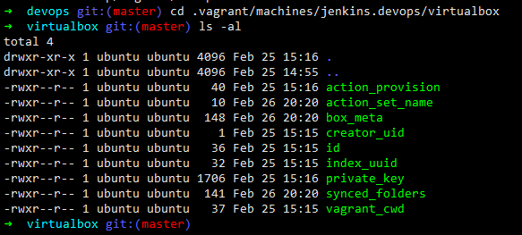

Hence, when using Vagrant it would be advisable to ring-fence the server from where Vagrant is being executed.
And also the default vagrant user must be changed.

## Ansible
Vagrant can be used to create a bare-metal machine preinstalled with an OS of your choice. You could also use shell scripting as shown below to pre-install/provision your softwares.

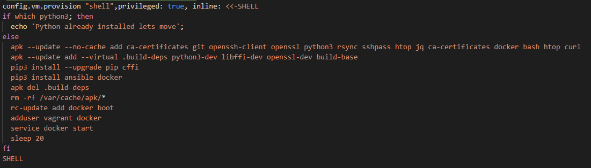

But using Shell to provision your infrastructure is quite cumbersome and has a steep learning curve especially when you are modifying files and folders.
[https://hvops.com/articles/ansible-vs-shell-scripts/](https://hvops.com/articles/ansible-vs-shell-scripts/)is a very interesting read as to why you should provision usig Ansible rather than shell scripts.


Ansible can be used to provision your database servers,web servers or any specific tool/binary too. Let's take a simple example which will help you not only to understand what Ansible is but also appreciate its power and simplicity.

Let's say you wish to install Logstash on your local machine. Below are the commands that need to be fired to install logstash as mentioned [here](https://devconnected.com/how-to-install-logstash-on-ubuntu-18-04-and-debian-9/).

```bash
sudo apt-get install default-jre
wget -qO - https://artifacts.elastic.co/GPG-KEY-elasticsearch | sudo apt-key add -
sudo apt-get install apt-transport-https
echo "deb https://artifacts.elastic.co/packages/7.x/apt stable main" | sudo tee -a /etc/apt/sources.list.d/elastic-7.x.list
sudo apt-get update
sudo apt-get install logstash
sudo systemctl status logstash
sudo systemctl enable logstash
sudo systemctl start logstash
```

This would start a default logstash service on your server but then thats not enough, you’ll also need to personalise the installation and to do that you’ll need to modify the ‘/etc/logstash/logstash.yml’ and also add a custom configuration file under the  ‘/etc/logstash/conf.d’ directory.

It is totally possible to write a shell script to fire the above commands for logstash installation and also copy the configuration files in their respective directory but then what about situations where your network connectivity is flaky ? Or some error occurs while while running the script ? or you wish to templatize the configuration file to add custom variables like the location of the elasticsearch server ?

It is exactly in these situations where Ansible comes very handy.

Below is the [playbook.yml](https://github.com/salecharohit/devops/blob/master/infrastructure/provisioning/logstash/playbook.yml) which does the following
1. Installs Java
2. Installs Logstash
3. Defines a variable for elasticsearch server


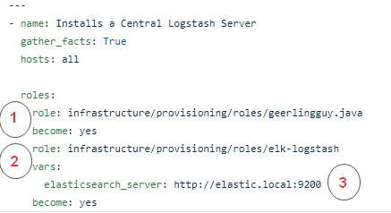

In Ansible we can encapsulate certain functionalities using a “Role” which can then be easily imported as shown above.
There are some roles which you can easily download from other open source repository the way I’ve done for Java from [https://github.com/geerlingguy/ansible-role-java](https://github.com/geerlingguy/ansible-role-java) and you can also create your own set of roles the way i’ve created for installing logstash. Let's explore that in more detail

I’ve defined the logstash role here https://github.com/salecharohit/devops/tree/master/infrastructure/provisioning/roles/elk-logstash

The [install.yml](https://github.com/salecharohit/devops/blob/master/infrastructure/provisioning/roles/elk-logstash/tasks/install.yml) file performs all the commands that are required for installing logstash


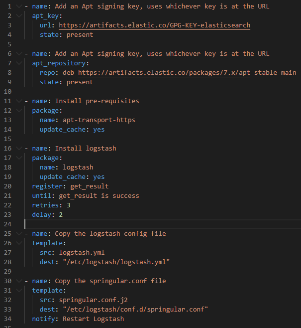

Few interesting points to observe about Ansible is (there maybe many more but just noting what i liked the most)
1. Retries method - in Line 22 we’ve explicitly instructed ansible to retry download of logstash binary at least 3 times in case of an error.
2. Jinja Templating - Line 31 defines the Jinja template of our configuration file where we can add variables and also perform various operations like looping adding conditional statements etc ..
Example of adding a variable in [springular.conf.j2](https://github.com/salecharohit/devops/blob/master/infrastructure/provisioning/roles/elk-logstash/templates/springular.conf.j2)

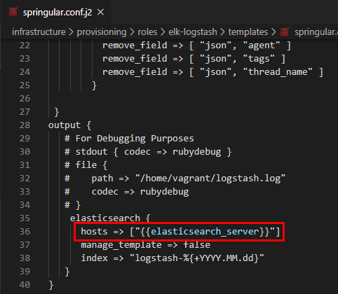

Example of looping in [filebeat.yml.j2](https://github.com/salecharohit/devops/blob/master/infrastructure/provisioning/roles/elk-filebeat/templates/filebeat.yml.j2)

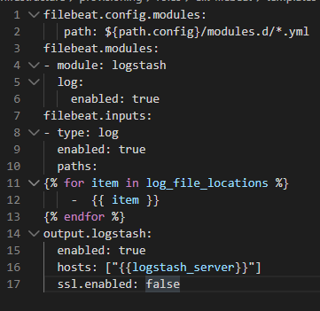

1. Amazing Collection of Modules
 - Service Module - You can start,enable and stop services very easily using the Service module as shown below
   [Code](https://github.com/salecharohit/devops/blob/bd2ef52ed34a3c59d16a8d39201a1fd08848bfd8/infrastructure/provisioning/roles/elk-logstash/handlers/main.yml#L7)

    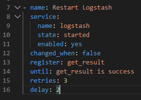

 - Lineinfile Module - Easily edit configuration files by adding line. As an example the below code adds an environment variable VAULT_ADDR in the /etc/environment file
  [Code](https://github.com/salecharohit/devops/blob/bd2ef52ed34a3c59d16a8d39201a1fd08848bfd8/infrastructure/provisioning/roles/hashicorp-vault/tasks/init.yml#L18)

  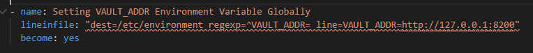

 - wait_for Module : Here wait for is not just about NOPs but also having conditional statements where you can pause execution until an event occurs for ex : wait till a port opens up to perform the next task.
  [Code](https://github.com/salecharohit/devops/blob/bd2ef52ed34a3c59d16a8d39201a1fd08848bfd8/infrastructure/provisioning/roles/hashicorp-vault/tasks/init.yml#L39)

  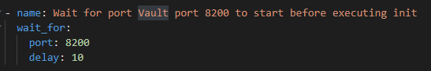

Ansible is a very powerful tool and the best way to work through ansible its very important to identify the following
1. The commands you need to execute.
2. The files you need to modify.
3. Privileges that will be required.

If you are able to map the above then writing ansible playbooks will be a breeze.
Following are the ansible roles that i created for this DevOps Lab to run on Ubuntu 18.04 LTS.

- [ElasticSearch](https://github.com/salecharohit/devops/tree/master/infrastructure/provisioning/roles/elk-elasticsearch)
- [Filebeat](https://github.com/salecharohit/devops/tree/master/infrastructure/provisioning/roles/elk-filebeat)
- [Kibana](https://github.com/salecharohit/devops/tree/master/infrastructure/provisioning/roles/elk-kibana)
- [Logstash](https://github.com/salecharohit/devops/tree/master/infrastructure/provisioning/roles/elk-logstash)
- [Hashicorp Vault](https://github.com/salecharohit/devops/tree/master/infrastructure/provisioning/roles/hashicorp-vault) (Modified from [https://github.com/MiteshSharma/AnsibleVaultRole](https://github.com/MiteshSharma/AnsibleVaultRole))

I used an existing Mailcatcher Role working on Ubuntu and ported it to Alpine OS
[https://github.com/salecharohit/devops/tree/master/infrastructure/provisioning/roles/ansible-role-mailcatcher](https://github.com/salecharohit/devops/tree/master/infrastructure/provisioning/roles/ansible-role-mailcatcher)

### Ansible Technical Issue

I observed an issue with the way Ansible works and i thought its best to share it so that you do not repeat the same mistake while making your ansible script as its not going to be fixed :-D
[https://github.com/ansible/ansible/issues/66928](https://github.com/ansible/ansible/issues/66928)

   So if you have a functionality that requires
1. A new group creation ( For Ex: create new a group called “test”)
2. Add an existing user to the newly created group (vagrant to the test group )
3. Run commands using the privileges of the newly created group ( Attempt to run commands using the privileges of the test group lets say accessing /opt/test/test.py)
4. Step 3 shall fail as ansible will not refresh groups while running the playbook. Because the privileges that you were expecting vagrant to inherit was not done.

### Security Considerations
Only specific folks should be allowed to invoke ansible commands , because using ansible we can potentially execute commands in all the machines that are provisioned using ansible.

Ansible playbooks may contain sensitive information like passwords which maybe used while provisioning as an example below. While using Ansible with vagrant the interactive session is disabled.
[Code](https://github.com/salecharohit/devops/blob/bd2ef52ed34a3c59d16a8d39201a1fd08848bfd8/infrastructure/provisioning/vault/playbook.yml#L13)

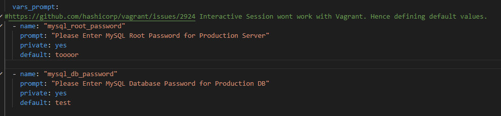

## Docker

If you are in IT and have not heard about Docker then seriously you need a lot of reading !

If you wish to learn Docker , [https://rominirani.com/docker-tutorial-series-a7e6ff90a023](https://rominirani.com/docker-tutorial-series-a7e6ff90a023) is the best resource i’ve ever come across.
Here I shall focus on describing docker through a problem solution approach

Problem

1. We have a jar file that works only on Java 8
2. You then need to install Java 8 on top of an existing installation if any or (update-alternatives and its issues :-P )
3. Create a new VM using Vagrant and provision it using Ansible
4. Push the jar in your new VM and then execute it.
   
That is really a very long process , what if we can accomplish that using a single software and a few lines of code ?

Solution

This is where Docker is extremely handy and it's just one of the many use cases of running docker. With docker you get exclusivity and isolation at the same time. You get to run Java 8 and also isolate it from our existing environment.

The below Dockerfile will do just the thing for us.

```dockerfile
FROM openjdk:8-jre-alpine
WORKDIR /home/ubuntu
ADD test.jar test.jar
EXPOSE 8080
CMD java -jar test.jar
```

Following will be the commands that we’ll need to execute to run and test our jar file which runs only on java-8

```bash
docker build -t testjar .
docker run -p 8090:8080 testjar
curl 127.0.0.1:8090
```
With the docker run command we can now run our java application exclusively on port 8090 and completely isolated from the host machine.

### Security Considerations

When running docker containers following are few of the considerations that must be taken into account

##### A) Running Docker containers with least privileges
   By default most Docker containers run with root privileges.
   When you run the below Dockerfile by default all the commands are being executed with the root user.

```dockerfile
FROM openjdk:8-jre-alpine
WORKDIR /home/ubuntu
ADD test.jar test.jar
EXPOSE 8080
CMD java -jar test.jar
```

To avoid that we must
1. Run all commands that require root privileges
2. Create a user
3. Switch Context to the newly created user
   
Same can be achieved by using the below Dockerfile
https://github.com/salecharohit/devops/blob/master/backend/Dockerfile

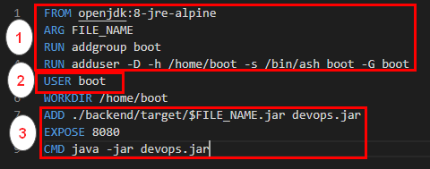

##### B) Exposing Docker Ports 

When we run the command 
```bash
docker run -p 8090:8080 
``` 
port 8090 is exposed on all network interfaces of the docker host machine. If the Docker host machine has let’s say 5 network interfaces exposed to 5 different networks then port 8090 will be exposed to all the networks.

That can be avoided by simply running the docker command as below. This allows port 8090 to be exposed only over 127.0.0.1


```bash
docker run -p 127.0.0.1:8090:8080
```

##### C) Reducing Attack Surface of Docker Containers

In Most dockerfiles that are imported using the FROM keyword , the base OS is a heavy Ubuntu/CentoOs image.

Same Java:8 running on two different base OSes. The difference in size is humungous !

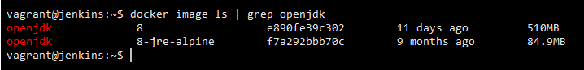

This difference in size is also attributed to the unnecessary kernel dependencies that are pushed into the docker image. More the dependencies wider the attack surface !

You want to run Java which can be accomplished in less than 85 MBs why to waste 510 MB unless specifically required !

Hence as far as possible try to use the base OS as alpine.

Here is a good guide to get started with slimming your containers
https://towardsdatascience.com/slimming-down-your-docker-images-275f0ca9337e


##### D) Never expose /var/run/docker.sock

I've seen a few tutorials where folks expose the docker.sock by mounting them as volumes

```dockerfile
   volumes:
  - "/var/run/docker.sock:/var/run/docker.sock"
 ``` 
This is a disaster in waiting because we are defeating the whole purpose of using Docker !
One of the major use cases of running docker is isolation. 
By exposing the docker.sock in a Docker image we are exposing the host environment completely !

Reference : https://stackoverflow.com/questions/40844197/what-is-the-docker-security-risk-of-var-run-docker-sock

Some More Docker Security Best Practices
- https://snyk.io/blog/10-docker-image-security-best-practices/
- https://dev.to/petermbenjamin/docker-security-best-practices-45ih 