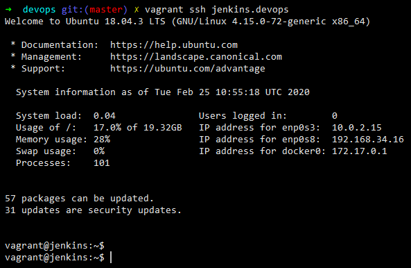
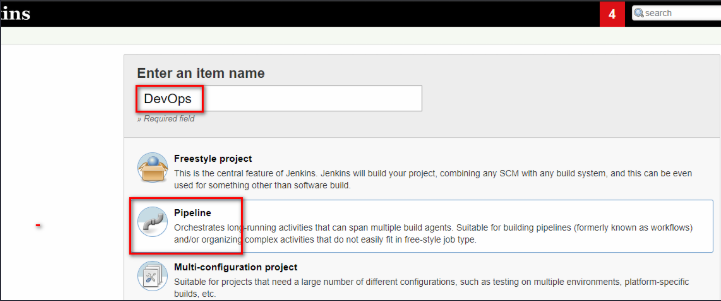

## Motivation

“DevOps” is one of the biggest buzzwords in the IT industry and is gaining considerable momentum in terms of technology,salaries,products and solutions every day.

Being a security professional I was very much interested in learning about the allied technologies that are used in a DevOps environment as it offers a completely different attack surface.

This blog series is my endeavour at understanding technologies like Jenkins,Docker,Vagrant,Ansible,Hashicorp Vault and the ELK stack and **most importantly how are they all weaved together.**

This blog series will not explain the basics of the underlying technologies like Docker,Jenkins etc and its best that you first learn or at least get a rough idea of what they are before trying to dive in.

## What to expect ?

In this blog series i shall talk about the 4 important terms that make up “DevOps” each through a separate blog post

1. [Infrastructure as Code(IaC)]() - Here we shall discuss Vagrant,Ansible and Docker and what exactly each of these technologies have to offer and how to use them effectively.
2. [Continuous Integration]() - We’ll learn how to modify and push changes to our main repo and also learn about how to avoid exposure of our credentials using tools like Hashicorp Vault and Talisman to avoid leakage of confidential information during commits and push.
3. [Continuous Delivery/Deployment]() - Here we’ll look at Jenkins and then understand the entire Jenkinsfile that i’ve written to automate the complete process of deployment right from the time the developer pushes the code to actual running of our application in staging and production environments.
4. [Continuous Monitoring]() - How to configure our application to continuously push out logs to the ELK stack for better visualizations.
   
## DevOps Lab - The Architecture

Practice makes everyone perfect. Hence, the best way to understand DevOps is by actually implementing a DevOps environment using the above mentioned technologies.

Below is the High-Level Architecture of what we are going to set up soon.

TL;DR

1. The entire environment is built using Vagrant+Virtualbox and provisioned using Ansible,completely automated setup.
2. Local Git is being used as the SCM
3. Jenkins is being used as the CI/CD server for pulling changes from the SCM , building, packaging the code and then deploying it onto the staging and production servers.
4. Staging and Production servers are running docker and jenkins will run the docker images of our application
5. Filebeats is deployed on staging as well as production API servers to feed the logs to logstash.Logstash ships them to Elasticsearch and Kibana is used to view them real-time.
6. For archiving our builds we are using a simple ubuntu machine to store the api and frontend build files.


## DevOps Lab - The Setup

Pre-Requisites 

1. Virtualbox (6.0) 
2. Vagrant (2.2.6)
3. Admin/Sudo privileges (This is required only for the Vagrant to update the hosts file with domain entries to vagrant machines)
4. Your favourite Code editor, I am using Visual Studio Code [downloaded using chocolatey](https://www.rohitsalecha.com/post/turning_your_windows_into_a_linux_powerhouse/#chocolatey-windows-package-manager)
5. Git installed locally , If you are a Windows user i recommend you first [install WSL(Windows Sub-system for Linux)]() as it’ll make your life a lot easier to work with in a DevOps environment.
6. At Least ~ 12GB of RAM
7. 80 GB of free Hard Disk
8. A very very very stable internet connection
9. Please ensure that your machine is pointing to a reliable DNS service like that of google i.e. 8.8.8.8 or 8.8.4.4
10. Patience

### Git

Step 1 :
Open up your command prompt and fire the below command to clone the repository in your local system.
```bash
git clone git@github.com:salecharohit/devops.git
```


### Vagrant

Next fire the magical command ‘vagrant up’ to bring up all your machines. You may be prompted for administrator/sudo access please approve them as the Vagrant script is updating your hosts file to map the domains with their respective IP Addresses.


With about 20 MBPS of average download speed i was able to provision the setup in around 48 minutes as can be seen from the asciinema roll below.



Open up your VirtualBox to see the machines running 


Since nothing is perfect in life things may be difficult while running such a long script. Hence i’ve created a separate [troubleshooting section]() below to help you with errors.

### Accessing the Machines
If you wish to access the machine using SSH it's fairly simple when you are using vagrant

```bash 
vagrant ssh <machine-name>
```

As an example if you wish to access jenkins then simply fire the command

```bash 
vagrant ssh jenkins.devops
```


<!-- (https://www.tablesgenerator.com/markdown_tables#) -->

| SrNo | Machine       | How To Access ?                                                                                                       |
|------|---------------|-----------------------------------------------------------------------------------------------------------------------|
| 1    | Jenkins       | [http://jenkins.devops:8080/](http://jenkins.devops:8080/) <br>jenkins:jenkins                                                                       |
| 2    | Mail          | [http://mail.devops/](http://mail.devops/)                                                                                                   |
| 3    | Kibana        | [http://kibana.devops:5601/app/kibana#/home](http://kibana.devops:5601/app/kibana#/home)                                                                            |
| 4    | Elasticsearch | [http://elastic.devops:9200/](http://elastic.devops:9200/ )                                                                                          |
| 5    | Vault         | [http://vault.devops:8200/ui/vault/auth](http://vault.devops:8200/ui/vault/auth) <br>root token available in the machine at below location<br>/etc/vault/rootKey  |
| 6    | Staging       | [http://staging.devops ](http://staging.devops )                                                                                                |
| 7    | Production    | [http://production.devops](http://production.devops)


### Jenkins

Open your favourite text editor to edit the [Jenkinsfile](https://github.com/salecharohit/devops/blob/master/Jenkinsfile). When the final vault.devops server finished processing it will spool out a token as shown in the screenshot below. MYSQL_DB_POLICY_TOKEN. Copy the value of that token and replace it with whatever value is present in the Jenkinsfile for the VAULT_TOKEN_MYSQL variable as shown in the screenshot below.


Visit [http://jenkins.devops:8080/](http://jenkins.devops:8080/) and login using jenkins:jenkins and visit [http://jenkins.devops:8080/credentials/store/system/domain/_/](http://jenkins.devops:8080/credentials/store/system/domain/_/) and then 
click ‘Add Credentials’ and a secret text string as shown below


We need to add two secret strings as shown below

> mysqlroot: tooor
> 
> mysqldbpw: test


Next , visit the link below and access Jenkins Email configuration wizard (by scrolling down) and enter the settings as shown in the screenshot
[http://jenkins.devops:8080/configure0](http://jenkins.devops:8080/configure)


You can also click on ‘Test configuration by sending test e-mail’ and verify if things are working fine as shown below.


The test mail received can be viewed at [http://mail.devops/](http://mail.devops/)


Click on Save and then on the main page click on “Create new Jobs”


Enter any value for name and select project type as “Pipeline”



Apply the following configurations , some general configurations.


Configuring Build triggers, a very important part of Jenkins automation.
Here we are triggering a build everytime a commit is pushed.


Then finally providing the location of the Jenkinsfile in the SCM.


Here we are specifying the repository as “/vagrant” because your entire folder from where we run ‘vagrant up’ is real-time synced with the virtual-machine.
Lets understand this a little better.
Checkout the asciinema recording below to understand this better.



Alternatively, if you have forked  the repository then you’ll need to feed in your Github/Bitbucket private SSH key in the credentials section and then add the URL of your repository.
I've explained this plenty of details in my 3rd Post on Continuous Integration

### Running The Pipeline

Now before we start the pipeline we need to check-in our code as we have modified it with a new vault token. Without which our production build will fail.
```bash
git status
```


As can be seen we have modified only the token value
```bash 
git diff Jenkinsfile
```


Commit the changes. Here we only need to commit the changes as our Jenkins is configured to read locally from our synced drive. If you are commiting to your repo then there’ll be an additional step involved here and i.e. ‘git push’
```bash
git add Jenkinsfile
git commit -m “updating vault token”
```


Let us now go back to Jenkins and browse to the project that we’ve created
[http://jenkins.devops:8080/job/<your-project-name>](http://jenkins.devops:8080/job/<your-project-name>)

In my case it is
[http://jenkins.devops:8080/job/DevOps/](http://jenkins.devops:8080/job/DevOps/)

And then click on “Build Now” as shown below.


Soon you shall see that your project has begun to build.


There is a better way of visualising the Jenkins builds using the OceanBlue plugin. To access that click on ‘Open Blue Ocean’ in the left-hand side menu and you’ll be redirected to the below screen.


Click on the Build # i.e. 1 to proceed further to view the below which shows that currently the ‘Build’ stage is in execution.


And then finally we have our pipeline complete after giving our nod for Production Deploy approval.


Our Application running in Staging


Finally, checkout our Continous Monitoring in action using elasticsearch kibana logstash and filebeat


### Troubleshooting

##### 1. Vagrant stuck/Network Disconnected/Ansible Error as shown below

The best solution here is to first check the status using
```bash
vagrant status
```

Then identify the machine which caused a problem. For Ex: logstash.devops
Then
 ```bash
 vagrant destroy logstash.devops -f
 ```

Finally , bring up and provision all those machines which are not in running state

```bash
vagrant up <machine-1> <machine-2> <machine-3> 
``` 
and so on…
Below example highlights all the steps

> NOTE: If you are destroying staging.devops production.devops and archiver.devops then ensure that once these machines are up you should also run

```bash
vagrant up jenkins.devops --provision
```
The reason why we need to do this is because Jenkins needs to read the SSH keys of these servers in order to execute commands remotely.

##### 2. Production Application is failing to start
If your production application is not showing any data its most likely because the vault token has expired. The best solution is to regenerate it using the following commands
```bash
vagrant ssh vault.devops
vault status
cat /etc/vault/rootkey | vault login -
vault policy list
vault token create -policy=mysql_db
```
Below is the asciinema roll for the above commands



##### 3. Vagrant SSH getting stuck or Vagrant machines not booting


Check if Virtualization is enabled in your Host
If you are running inside an Ubuntu Guest VM then ensure that virtualization has been enabled “vt-x” as shown below for Virtualbox.


##### 4. Jenkins Version Update

When installing Jenkins using the [geerlinguy-jenkins-role](https://github.com/geerlingguy/ansible-role-jenkins) there is an open issues where any version above 2.191 the automatic plugin installation fails. Below is the link to the issues in question.
[https://github.com/geerlingguy/ansible-role-jenkins/issues/269](https://github.com/geerlingguy/ansible-role-jenkins/issues/269)
Hence, while provisioning Jenkins i am using version 2.191 and post provisioning if you would like to update Jenkins then peruse the commands below.
```bash
vagrant ssh jenkins.devops
sudo service jenkins stop
cd /usr/share/jenkins
sudo curl -o jenkins.war http://ftp-chi.osuosl.org/pub/jenkins/war/2.222/jenkins.war
sudo service jenkins restart
```
