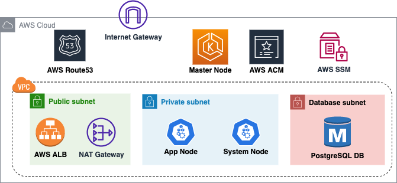
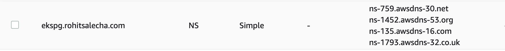
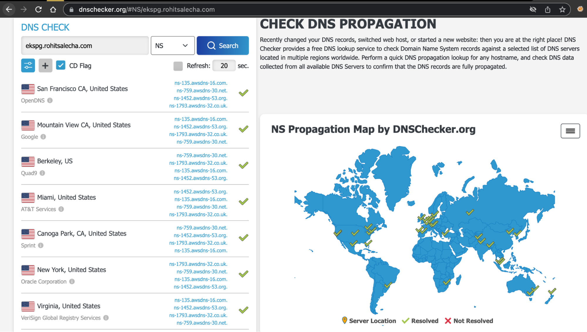
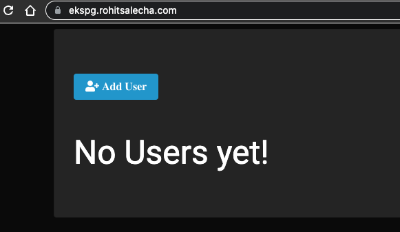
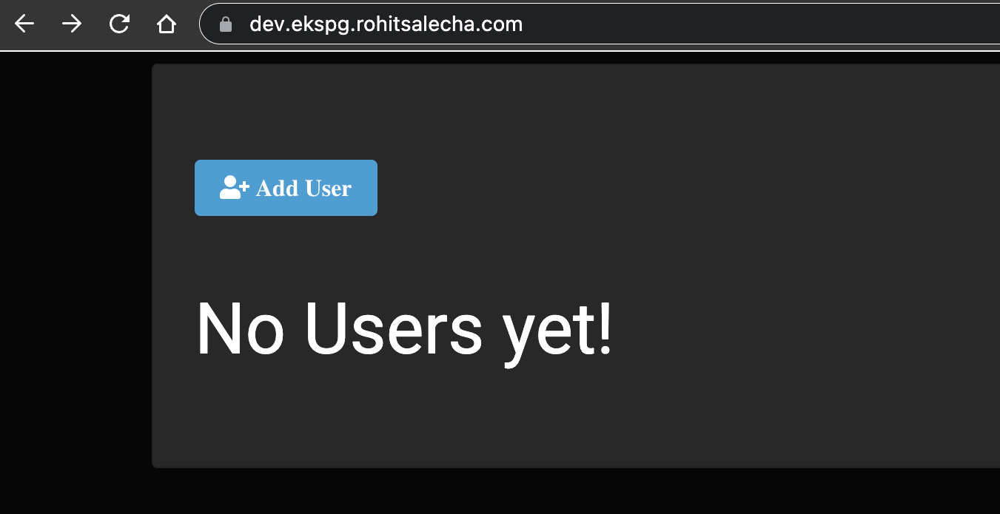

## Motivation

This blog is a leaf out of my book Practical GitOps where I discuss how one can manage AWS infrastructure using Terraform and orchestrate it with Github Actions.

As part of my book I’ve deployed a working SpringBoot application on AWS EKS as a base for explaining everything around it right from AWS Organizations to Secrets Management, IRSA to setting up an observability stack. This blog is all about that base application and the surrounding infrastructure.

Also, with the entire cloud and cloud native ecosystem having so many different tools I needed a playground which I could set up quickly and then destroy. This project gives me that flexibility so that I can quickly set up an EKS(kubernetes) environment and then play around with various different tools and its obvious integration with AWS.

Link to buy the book and how to get a 20% discount coupon code is shared towards the end of the post [Shameless Plug]()

## Architecture



The above diagram shows a high-level architecture of the base infrastructure that we are doing to deploy.Other than Route53, rest everything will be set up using Terraform in this blog. A brief description follows

* We’ll be creating a VPC with three subnets namely: public,private and database.
* Public subnet will have resources that need to be externally facing like the AWS Application Load Balancer which will be spun up as an Ingress Controller.
* Our Kubernetes Nodes (managed by us) will be spun up in the Private subnet having and will not be accessible from the internet.
* The Master node of Kubernetes is completely managed by AWS and hence we have no control over its placement. However the Kubernetes API-endpoint will be available over 443 on the internet for authentication to EKS cluster.
* Our PostgreSQL Database is living in the database subnet which is a separate subnet having additional security controls.
* The connectivity between the Public Subnet and the Private subnet is established using a NAT gateway. There is no NAT gateway to route traffic between Database Subnet and Public subnet hence it is sufficiently isolated.
* We’ll be utilizing AWS Certificate Manager (ACM) to generate the public SSL certificates for our application. Our Terraform code will not only generate the certificates but also validate the certificates by creating necessary Route53 name records.

## Pre-Requisites

In order to follow along this blog you’ll need the following

* An AWS account with credentials configured in CLI
    * [https://docs.aws.amazon.com/cli/latest/userguide/cli-configure-quickstart.html](https://docs.aws.amazon.com/cli/latest/userguide/cli-configure-quickstart.html) 
* A top level domain/subdomain name
* Kubectl Utility - Kubectl is the default utility to talk with the kubernetes service that we’ll be spinning up using Terraform. Recommended to have version 1.20 or above.
    * [https://kubernetes.io/docs/tasks/tools/](https://kubernetes.io/docs/tasks/tools/)
* Terraform binary installed
    * [https://developer.hashicorp.com/terraform/tutorials/aws-get-started/install-cli](https://developer.hashicorp.com/terraform/tutorials/aws-get-started/install-cli)
* Your favorite Code editor

> WARNING : Running the scripts in this blog will charge you some amount of money as AWS EKS and other services here are not under the free-tier. Also, this is only a demo project. Exercise caution and encourage you to learn more about it before trying it out.

## AWS Route53

First thing we need to do is create a [Route53 Hosted Zone](https://docs.aws.amazon.com/Route53/latest/DeveloperGuide/hosted-zones-working-with.html) with a domain/subdomain of your choice. I am demonstrating using a sub-domain that is **ekspg.rohitsalecha.com**. You could use a primary domain as well but the nameserver configuration will need to be tweaked accordingly.

The below command will help you in creating a route53 hosted zone from CLI and make a note of the **NameServers** as shown below. 

**“--caller-reference”** is a random number so the best bet is to use your current timestamp as shown.

```bash
cmd> export AWS_PROFILE=<your-profile>
cmd> aws route53 create-hosted-zone --name ekspg.rohitsalecha.com \
    --caller-reference 2023-02-21-24:35

{
XXXXXXXXXXXXXXX------SNIPPED-------XXXXXXXXXXXXXXXXXXXXX
	"DelegationSet": {
    	"NameServers": [
        	"ns-537.awsdns-03.net",
        	"ns-449.awsdns-56.com",
        	"ns-1848.awsdns-39.co.uk",
        	"ns-1415.awsdns-48.org"
    	]
	}
}
```

## Configuring NameServers

The command output provides 4 different Nameserver values that need to be configured with your DNS provider depending on whether you are configuring a Top-level domain like **rohitsalecha.com** or a subdomain like **ekspg.rohitsalecha.com**

If you have GoDaddy as your DNS provider then follow this guide for Top-Level Domains [https://in.godaddy.com/help/change-nameservers-for-my-domains-664](https://in.godaddy.com/help/change-nameservers-for-my-domains-664)

For subdomain in GoDaddy this is how you can add a NS as a record [https://in.godaddy.com/help/add-an-ns-record-19212](https://in.godaddy.com/help/add-an-ns-record-19212)

Since I am using a Subdomain this is how I configured my NS records provided by the hosted zone command fired above.



Once your DNS configuration is done do give it a check on [https://dnschecker.org/](https://dnschecker.org/) as shown below. 

> Only once all is green move on to the next steps. Give it atleast 30 mins to propogate



## Github Clone

Clone the Github repository  

[https://github.com/salecharohit/eks-playground](https://github.com/salecharohit/eks-playground)

Open the repository in your favorite code editor and open the file **infra/terraform.auto.tfvars** as shown below.

```
File: infra/terraform.auto.tfvars
{
XXXXXXXXXXXXXXX------SNIPPED-------XXXXXXXXXXXXXXXXXXXXX

33: 
34: /********** EKS Module ***************/
35: 
36: eks_version    = "1.21"
37: instance_types = ["t3.medium","t3.small"]
38: 
39: /********** Global Variables ***************/
40: org_name = "ekspg"
41: domain   = "ekspg.rohitsalecha.com"
```

We need to modify the value **domain** on **Line41** as shown above pointing to the domain that you’ve setup in the earlier section.

> NOTE: Feel free to modify the above parameters as you see fit provided you know what you are doing.

## Terraform Execution

Once the modification of the domain name is done, its time to execute our code using the commands as shown below.

```bash
cmd> export AWS_PROFILE=<your-profile>
cmd> cd eks-playground/infra
cmd> terraform init
cmd> terraform validate
cmd> terraform plan
cmd> terraform apply --auto-approve

XXXXXXXXXXXXXXX------SNIPPED-------XXXXXXXXXXXXXXXXXXXXX
Apply complete! Resources: 88 added, 0 changed, 0 destroyed.

Outputs:

cluster_name = "ekspg-us-east-1-dev"
region = "us-east-1"
```

## Accessing Application

After executing Terraform apply it’ll take upto 20-25 minutes to spin up the entire application+infrastructure. Once the Apply Complete message is shown , wait for 5 minutes more for the Load Balancer to warm up and our site should start functioning and accessible as shown below

[https://ekspg.rohitsalecha.com](https://ekspg.rohitsalecha.com) 



Accessing through kubectl

```bash
cmd> export AWS_PROFILE=<your-profile>
cmd> REGION=$(terraform output -raw region)
cmd> CLUSTER=$(terraform output -raw cluster_name)
cmd> aws eks --region $REGION update-kubeconfig --name $CLUSTER

Added new context arn:aws:eks:us-east-1:26XXXXXXXXX23:cluster/ekspg-us-east-1-prod to /Users/XXXXXXXXXXX/.kube/config

cmd> kubectl get nodes

NAME                          STATUS   ROLES    AGE   VERSION
ip-10-0-12-238.ec2.internal   Ready    <none>   14m   v1.21.14-eks-48e63af
ip-10-0-13-155.ec2.internal   Ready    <none>   14m   v1.21.14-eks-48e63af
```

## Terraform Destroy

To destroy the app simply fire the below command

```bash
cmd> export AWS_PROFILE=<your-profile> 
cmd> terraform destroy --auto-approve 
```

## Destroy Hosted Zone

If the hosted zone is not needed destroy that too as it costs 0.5$ per month

```bash
cmd> export AWS_PROFILE=<your-profile> 
cmd> aws route53 list-hosted-zones

{
    "HostedZones": [
        {
            "Id": "/hostedzone/Z0649256M3CSJUPI94TE",
            "Name": "ekspg.rohitsalecha.com.",
            "CallerReference": "2023-02-21-24:35",
            "Config": {
                "PrivateZone": false
            },
            "ResourceRecordSetCount": 2
        }
    ]
}

cmd> aws route53 delete-hosted-zone --id Z0649256M3CSJUPI94TE
```

## Multi-Environment Configuration

If you’d like to configure multiple environments like dev,staging etc … then this script allows you to modify the same in **_infra/variables.tf _** as shown below.

```
File: infra/variables.tf

3: 
4: variable "environment" {
5:   description = "The Deployment environment"
6:   type        = string
7:   default     = "prod"
8: }
9: 
```

Default value is configured as “prod” however the same can be overridden in the infra/terraform.auto.tfvars file as dev or staging.

The script shall automatically check which environment is configured and also update the Route53 domain. As an example, I modified the environment variable as “dev” and once I started the application I got the URL as shown below.

[https://dev.ekspg.rohitsalecha.com/](https://dev.ekspg.rohitsalecha.com/)



This magic is happening in this script between **Line10-16** as shown below

```
File: infra/dns.tf

10: locals {
11: 
12:   staging_url = var.environment == "staging" ? "staging.${var.domain}" : ""
13:   prod_url    = var.environment == "prod" ? "${var.domain}" : ""
14:   dev_url     = var.environment == "dev" ? "dev.${var.domain}" : ""
15: 
16:   url = coalesce(local.staging_url, local.prod_url, local.dev_url)
17: 
18: }
```

## What Next ?

As can be seen we deployed the SpringBoot app in the “app” folder which is dockerized as “salecharohit/practicalgitops“ on hub.docker.com.

This app can be changed in the file **infra/app.tf** as shown below.

```
File: infra/app.tf
24: 
25: resource "kubernetes_deployment_v1" "app" {
XXXXXXXXXXXXXXX------SNIPPED-------XXXXXXXXXXXXXXXXXXXXX
49: 
50:       spec {
51:         container {
52:           image = "salecharohit/practicalgitops"
53:           name  = var.org_name
54:           env {
55:             name  = "DB_PORT"
56:             value = "5432"
57:           }
58:           env {
59:             name  = "DB_HOST"
60:             value = module.pgsql.db_instance_address
61:           }
62:           env {
63:             name  = "DB_NAME"
64:             value = var.db_name
65:           }
66:           env {
67:             name  = "DB_USERNAME"
68:             value = var.db_user_name
69:           }
70:           env {
71:             name  = "DB_PASSWORD"
72:             value = module.ssmr-db-password.ssm-value
73:           }
```

**Line 52** is where the docker image location needs to be modified. Do configure the remaining parameters as shown between **L54-73** as environment variables which will be very specific to your app.

For More AWS EKS specific use-cases/scenarios like installing Karpenter,working with secrets store etc … to check out this repo , it’s awesome and well maintained.

[https://github.com/aws-ia/terraform-aws-eks-blueprints](https://github.com/aws-ia/terraform-aws-eks-blueprints) 


## Shameless Plug

Using this setup as a base I am discussing the following in my book [Practical GitOps - Infrastructure Management using AWS,Terraform and Github Actions.](https://link.springer.com/book/10.1007/978-1-4842-8673-9)

**CI/CD and Multi-Environment**

* Orchestrate the entire CI/CD pipeline for Docker build and Terraform Deployment in Github Actions.
* Managing the state of Terraform in a multi-environment configuration like dev,staging and prod.

**Authentication and Access Management**

* Setting Up AWS Organisations with different OUs for environments like dev,staging,production and identity.
* Configuring all users in a single identity account and creating IAM Roles for them in the respective dev, staging and prod accounts for them to assume with full RBAC.
* Creating Kubernetes RBAC by aligning IAM Roles with specific k8s groups. So an engineer in dev account gets admin in k8s but in prod account the same engineer gets only read only. Accessing Kubernetes through kubcectl only by assuming the specific IAM Role that user has been given.
* Implementing IRSA(IAM Roles and Service Account) through Terraform and attaching limited identity/privileges to k8s pods.

**Security**

* Creating secrets in AWS Secrets Manager and loading them onto K8s Pods using "Secrets Store CSI Driver" by leveraging IRSA
* Implementing basic security controls on EC2 Nodes created by EKS like IMDSv2 ,Encrypting EBS drives and encrypting k8s Secrets using AWS KMS keys.
* Integrating Checkov using Github Actions and spooling results in PRs
* Creating Route53 DNS Zones for each of the dev, staging and prod accounts
* Implementing Service Control Policies that lock regions of deployment,Ensuring that only encrypted EBS and RDS are deployed in staging/production,Disabling user creation in all accounts except identity,Restricting the instance types that can be created in Development OU

**Observability**

* Centralizing CloudTrail into master account by leveraging and creating organization trail
* Storing AWS ALB logs in S3 bucket
* Creating CloudWatch Alarms for detecting root login in AWS accounts 
* Starting OpenSearch and spooling all k8s and app logs to it for prod account 
* Spinning up Prometheus and Graphana for Prod account for performance monitoring
* Installing Karpenter for node scaling

Use the following link to buy the book

[https://link.springer.com/book/10.1007/978-1-4842-8673-9](https://link.springer.com/book/10.1007/978-1-4842-8673-9) 

DM me for a 20% Coupon Code on

[https://www.linkedin.com/in/rohitsalecha/](https://www.linkedin.com/in/rohitsalecha/)

OR

[https://twitter.com/salecharohit](https://twitter.com/salecharohit) 
