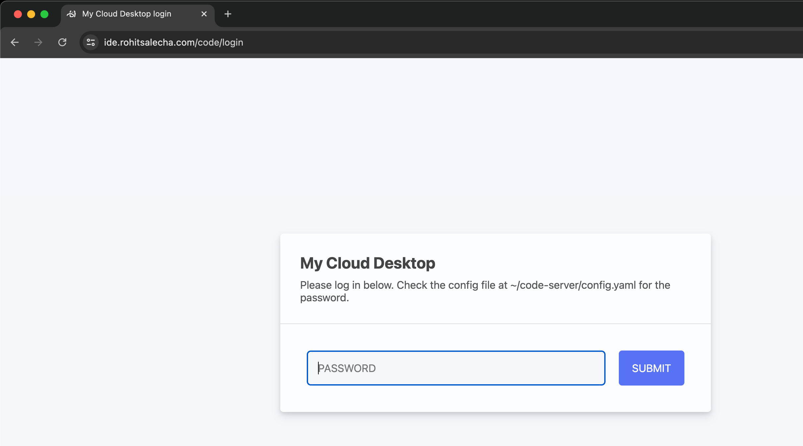
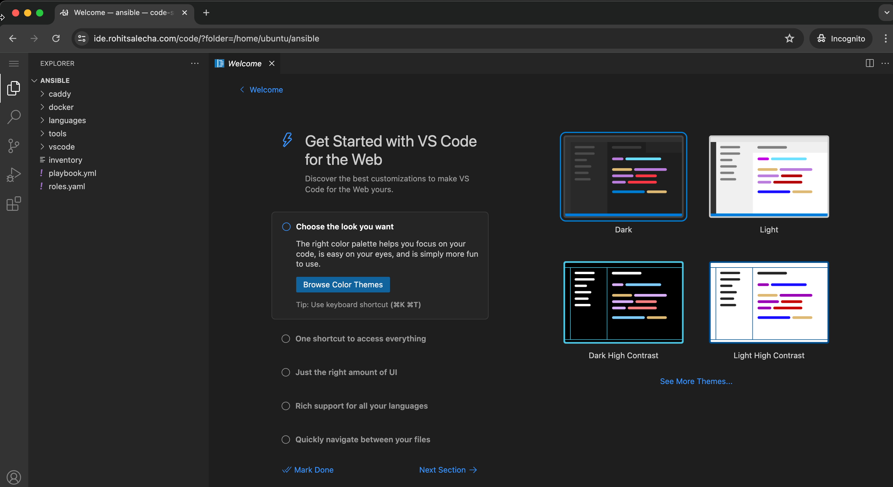
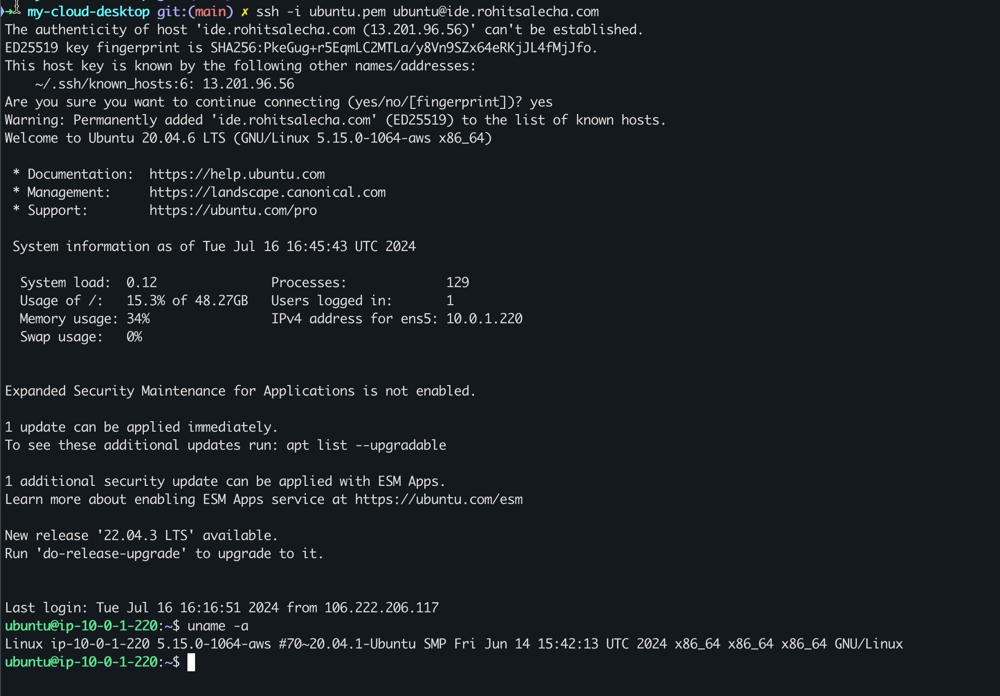

## Motivation

For quite some time I've primarily been using *nix terminal (Ubuntu-WSL2 and MacOS) and VSCode for most of my research/pentest and day-to-day work. I like to keep my base machine as clean as possible with the least number of softwares needed like just the CLI and browser. I would use this bare-minimum software to connect to my cloud machine where most of my softwares/services are installed like nmap,metasploit,awscli,terraform etc ... 

But the problem was that I the requirement for this machine was quite intermittent and sporadic, it was never constant. So each time I needed the machine, I'd login to my console,start it,change my IP in the laptop and then go about doing my job. This was quite cumbersome and tedious and manual.

Also, I didn't want to remember the IP address everytime I spin up, just the Domain name as it becomes easier to configure domain names on internet than IP addresses.

Hence, out of pure laziness I decided to write a `terraform` + `ansible` script (a combination I'd been wanting to work on for a long long long long long time) that does the following 

- Spins up an EC2 Ubuntu Focal (:heart:) 
- Configures it with my most used softwares - VSCode,NMap,Nuclei,Semgrep,awscli and some pentest tools.
- Configure my Duck DNS domain name (rohit-salecha.duckdns.org) with the IP Address of the EC2 with LetsEncrypt Certificate. 
- Have a Source IP restriction such that it is accessible only from a specific IP Address like my home ip.

## Pre-Requisites

* An AWS account with credentials configured in CLI
    * [https://docs.aws.amazon.com/cli/latest/userguide/cli-configure-quickstart.html](https://docs.aws.amazon.com/cli/latest/userguide/cli-configure-quickstart.html) 
* DuckDNS Account and Domain - [https://www.duckdns.org/](https://www.duckdns.org/)
    * Please read through the Terms and Conditions before using this service https://www.duckdns.org/tac.jsp 
* Terraform binary installed
    * [https://developer.hashicorp.com/terraform/tutorials/aws-get-started/install-cli](https://developer.hashicorp.com/terraform/tutorials/aws-get-started/install-cli)
    * Minimum version 1.4

## Warnings

Some important warnings before you start using the code

- Running the scripts in this blog will charge you money as we are downloading quite a lot of content to the cloud machine and the bare minimum 4 GB RAM machine is needed which doesn't fall into free tier.
- Opening up of port 80 is necessary for the entire internet as it's needed for LetsEncrypt validation.
  [https://letsencrypt.org/docs/allow-port-80/](https://letsencrypt.org/docs/allow-port-80/)
- Port 53 is also open but no service is currently configured to listen on it. You can start your own DNS server for SSRF pingbacks.  
- Any abuse of the code and the service provided is solely the responsibility of the user.

## Duck DNS

Duck DNS is a free service where you can create a sub-domain of your choice <your-domain>.duckdns.org and they  have a simple curl command that allows you to update the DNS A record with the IP Address of the EC2 machine as shown below.

```
https://www.duckdns.org/update?domains={YOURVALUE}&token={YOURVALUE}[&ip={YOURVALUE}][&ipv6={YOURVALUE}][&verbose=true][&clear=true]
```

I've implemented this as a curl command in my terraform code which automatically reads the IP from the EC2 machine and updates the DNS record.

In order to use this, you'll first need to sign up, create a sub-domain of your choice and save the token provided as shown below.


> Any abuse of the code and the service provided is solely the responsibility of the user.

## Github Clone

Clone the Github repository 

[https://github.com/salecharohit/my-cloud-desktop.git](https://github.com/salecharohit/my-cloud-desktop.git) 

```bash
cmd> git clone https://github.com/salecharohit/my-cloud-desktop.git
cmd> cd my-cloud-desktop
cmd> mv terraform.auto.tfvars.bak terraform.auto.tfvars
```

Once clone is done edit the **terraform.auto.tfvars** file and configure the following required variables with the necessary data.

```yaml
# Region of deployment of EC2, its recommended to deploy closest possible to avoid latency
region                      = "ap-south-1"
# Recommneded is t3.medium or select from here https://instances.vantage.sh/
instance_type               = "t3.medium"
# Whether to apply source IP restrictions for SSH Access. 
# IP Address from where you are executing the terraform script will be used to restrict access to port 443 and 22.
# Check file networking.tf
apply_source_ip_restriction = true
duckdns_token               = "XXXXXXXXXXXXXXXXXXXXXXXXXX"
duckdns_hostname            = "XXXXXXXXXXXX.duckdns.org"
email                       = "XXXXXX@XXXXXX.com"
vscode_password             = "XXXXXXXXXXXXXXXXXXXXXX"
```

> NOTE : The **terraform.auto.tfvars** is part of your .gitignore hence any changes made in this file will not be comitted in your remote repository and will only remain on your machine.

## Terraform Execution

Once everything is set its time to execute our code using the commands as shown below.

```bash
cmd> export AWS_PROFILE=<your-profile>
cmd> cd my-cloud-desktop
cmd> terraform init
cmd> terraform validate
cmd> terraform apply --auto-approve
 
XXXXXXXXXXXXXXX------SNIPPED-------XXXXXXXXXXXXXXXXXXXXX
Apply complete! Resources: 43 added, 0 changed, 0 destroyed.

Outputs:

server_ip = "15.206.158.91"
```

## Accessing VSCode in browser

Once the apply is complete navigate to domain name you've configured and enter the password as shown in the screen below.



After entering the password we can start using VSCode as shown below.



Accessing Terminal from VSCode ex : Metasploit

(img/6.png)

## Accessing Server through SSH

The code generates a private SSH key called `ubuntu_key.pem` in the keypair.tf file and stores it in your local system. The .gitignore file ignores all *.pem files and hence this will not be committed to your Git history and usable only from the local machine you are operating from.

Accessing the server is quite simple.

```bash
cmd> ssh -i ubuntu_key.pem ubuntu@<your-duckdns-domain>
```



Or you could also save it in an ssh config as which is something that you no longer need to change now. Just ensure the `path-to-ubuntu-key` is configured correctly.

```config
Host cloud-desktop
HostName <your-domain>.duckdns.org
Port 22
User ubuntu
IdentitiesOnly yes
IdentityFile <path-to-ubuntu-key>/ubuntu_key.pem
```

## Accessing Miscellaneous Services

In case you wish to access any GUI service within the server that's running on a port like 8080, but you donot wish to open it up on the internet then simply execute the following commands.

```bash
ssh -i ubuntu_key.pem ubuntu@<your-duckdns-domain> -L 8081:localhost:8080
curl http://localhost:8081
```

Using the above command you are instructing that port 8081 on your local computer needs to be forwarded to port 8080 on the EC2 server. This forwarding of the traffic is now happening over a secure channel and you donot have to open up your machine to the internet.

## Terraform Destroy

To destroy the app simply fire the below command

```bash
cmd> export AWS_PROFILE=<your-profile> 
cmd> terraform destroy --auto-approve 
```

